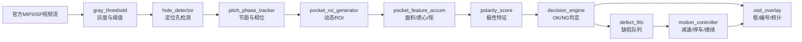

# 国产FPGA载带元件智检仪——分阶段开发与逐级验证路线

> 目标：把项目拆成前后依赖明确、每一步都能单独验收的阶段。上一阶段没有形成可重复证据，不进入下一阶段。  
> 平台：PH1P35 FPGA、HX1P35A 开发板、SC500CS MIPI 摄像头、HDMI 显示。  
> 稳定版主线：定位孔同步 → 逐穴编号 → 空穴/偏位/旋转/极性检测 → NG 跟踪 → 精准停车 → 处置后复检。

资源预算、官方例程使用边界和RTL编码强制规范见：`02_FPGA资源预算与代码优化规范.md`。

FPGA层级、模块数据流和A/B/C组负责人关系见：`03_系统框架与模块负责人流程图.md`。

## 1. 总体推进关系

```mermaid
flowchart LR
    S0["阶段0<br/>环境与版本基线"] --> S1["阶段1<br/>官方视频链路"]
    S1 --> S2["阶段2<br/>样品与成像生死验证"]
    S2 --> S3["阶段3<br/>离线算法金标准"]
    S3 --> S4["阶段4<br/>FPGA图像处理底座"]
    S4 --> S5["阶段5<br/>定位孔与动态ROI"]
    S5 --> S6["阶段6<br/>逐穴缺陷判定"]
    S6 --> S7["阶段7<br/>送料机构独立验证"]
    S7 --> S8["阶段8<br/>连续运动与编号同步"]
    S8 --> S9["阶段9<br/>NG队列与精准停车"]
    S9 --> S10["阶段10<br/>处置与二次复检闭环"]
    S10 --> S11["阶段11<br/>配方、统计与整机测试"]
    S11 --> S12["阶段12<br/>冲刺功能"]
```



执行纪律：

1. 每阶段只增加一种主要变量，例如先加算法，不同时改镜头、光源和机械结构。
2. 每阶段都保留一个可退回的工程版本和对应 bitstream。
3. 所有“能用”“稳定”“实时”都必须用照片、视频、日志或数据表证明。
4. 阶段门未通过时，先修当前问题，不用后级功能掩盖前级缺陷。
5. 官方例程只作只读基线；项目代码必须从副本开发。

## 2. 推荐工程目录

后续开始写代码时，建议在主工程中采用以下结构：

```text
开发实施/
FPGA工程/
  00_官方Lab1只读基线/
  01_视频链路基线/
  02_图像预处理/
  03_定位孔与ROI/
  04_逐穴检测/
  05_运动闭环/
机械与硬件/
测试数据/
  00_原始图像/
  01_标注真值/
  02_离线算法结果/
  03_FPGA实测结果/
测试记录/
```

不要在同一个 TD 工程中不断覆盖修改。每通过一个阶段，保存：工程副本、下载文件、资源报告、时序报告和验收记录。

---

## 3. 阶段0：建立环境和版本基线

### 目标

先确认手里的板、摄像头、工具和官方工程确实对应，避免后面把版本问题误认为代码问题。

### 实施步骤

1. 拍摄开发板正反面和芯片丝印，记录实物到底标为 HX1P35A 还是其他版本。
2. 记录 FPGA 完整型号，应确认到 `PH1P35MDG324` 这一层级。
3. 检查 SC500CS 摄像头排线方向和接口座，不带电插拔 MIPI 排线。
4. 准备 HDMI 显示器、下载线、稳定电源和串口线。
5. 安装并启动安路 TD 工具，确认能识别下载器和开发板。
6. 将官方 Lab 1 解压到 `FPGA工程/00_官方Lab1只读基线`，不修改源文件。
7. 建立阶段验收记录，记录工具版本、板卡版本和官方工程来源。

### 通过标准

- TD 可以正常启动；
- 下载器可以识别；
- 板卡上电无异常发热、异味或电源反复重启；
- 实物版本、开发板手册和例程约束之间的差异已经记录。

### 阶段输出

- 板卡与摄像头照片；
- 硬件清单；
- TD 版本和安装记录；
- 一份未修改的官方 Lab 1 基线。

> 未通过时：不要接电机、补光板或其他扩展硬件，先解决供电、下载器和板卡版本问题。

---

## 4. 阶段1：跑通官方视频链路

### 目标

不加入任何载带检测算法，先证明下面这条链路稳定：

`SC500CS → MIPI接收 → RAW10/ISP → DDR2 → HDMI`

### 实施步骤

1. 复制官方 Lab 1，建立 `FPGA工程/01_视频链路基线`。
2. 使用官方约束完成一次完整综合、布局布线和 bitstream 生成。
3. 保存综合资源报告和时序报告，不忽略红色错误或未约束时钟警告。
4. 先连接摄像头和 HDMI，再按照板卡手册上电、下载。
5. 确认 HDMI 能持续显示摄像头画面。
6. 分别拍摄白纸、彩色物体、载带定位孔和候选元件，观察清晰度、颜色和画面方向。
7. 连续运行 30 分钟，观察黑屏、花屏、撕裂、闪烁和画面停滞。

### 通过标准

- 连续 30 分钟无黑屏、花屏或死机；
- 摄像头画面方向和显示分辨率已经记录；
- 编译无致命错误，时序结果可接受；
- 断电重新上电后能够重复运行；
- 保存一份确认可用的 bitstream。

### 阶段输出

- `视频链路基线` 工程；
- 30 分钟运行视频；
- 资源报告、时序报告；
- 基线 bitstream 和恢复方法。

> 未通过时：只检查排线、供电、约束、摄像头初始化、MIPI 和 DDR/HDMI 链路，不开始写检测算法。

---

## 5. 阶段2：样品、镜头和光源生死验证

### 目标

在做 FPGA 算法前，证明真实样品的定位孔、轮廓和极性特征确实能从顶部拍清楚。

### 实施步骤

1. 准备至少三种候选元件，优先比较 SOD-123/SMA 二极管、3528 LED 和钽电容。
2. 每种元件准备正常方向、180°反向、空穴和可控偏位样品。
3. 用简易固定支架保持摄像头垂直，先测试 16 mm 镜头。
4. 调节工作距离，使画面完整覆盖载带宽度和约 5～7 个穴位。
5. 搭建均匀漫射顶光；定位孔边界不稳定时再增加背光实验。
6. 固定曝光、增益、白平衡和焦距，避免自动参数在连续画面中漂移。
7. 每种状态至少保存 30 张图像，并记录工作距离、视场、光源位置和相机参数。
8. 轻微改变载带横向位置和光照亮度，检查特征是否仍然可分。

### 通过标准

- 定位孔在整个视场中都能稳定看清；
- 载带宽度完整进入画面，边缘穴位仍可用；
- 空穴和正常件可以明显分开；
- 正常与反向的顶部特征可重复区分；
- 元件移动约 0.2～0.5 mm 时，图像中的中心变化方向正确；
- 连续重复放置不会因轻微反光导致正反完全混淆。

### 决策门

- LED 极性稳定：LED 可作为主样品。
- LED 极性不稳定，但二极管色带稳定：改用 SOD-123 或 SMA 二极管。
- 所有候选都不稳定：先更换光源、镜头或样品，不能依靠复杂算法硬猜。

### 阶段输出

- 锁定的一种主样品和具体料号；
- 锁定的载带宽度、穴位节距、镜头和工作距离；
- 固定光源方案；
- 第一批带真值标签的图像数据。

> 这是项目的生死阶段。没有通过，机械和 FPGA 检测模块都暂缓。

---

## 6. 阶段3：建立离线算法金标准

### 目标

先在电脑上证明算法逻辑有效，再把已经验证的步骤改写成 FPGA 流水线。电脑只用于开发验证，最终作品不依赖电脑。

### 实施步骤

1. 将图像分成训练/调参集和独立测试集，不能使用同一批图片既调阈值又报成绩。
2. 先检测载带定位孔，输出孔中心、孔间距和检测置信度。
3. 根据定位孔建立穴位坐标和动态 ROI，而不是在画面中写死绝对坐标。
4. 对每个穴位依次实现：
   - 空穴：前景面积或轮廓面积；
   - 偏位：元件中心相对穴位中心的 X/Y 偏差；
   - 旋转：二阶矩、主轴或稳定边缘方向；
   - 极性：色带区域、左右/上下区域差分或小模板相关。
5. 保存每个样品的中间量，不只保存最后 OK/NG。
6. 将除法、浮点、复杂函数逐步替换为 FPGA 可实现的定点、移位、查表和累加结构。
7. 确定每个特征阈值和允许范围，形成第一版参数配方。

### 通过标准

- 独立测试集上，空穴、偏位、旋转和极性均能稳定工作；
- 输出的偏移方向和角度与真实摆放一致；
- 定位孔轻微横移后，ROI 能跟随载带；
- 算法不依赖大型神经网络和大量浮点运算；
- 每一步都能写成明确的输入、输出和位宽。

建议早期目标：每类至少 30 个正常/异常样本，单项正确率先达到 95% 左右，再进入 FPGA 移植。该数值只是阶段门，不是最终比赛成绩。

### 阶段输出

- 离线算法代码；
- 带真值的数据集；
- 每类特征分布图和阈值；
- FPGA 模块接口、计算公式和建议位宽。

> 未通过时：回到阶段2调整样品、光学和特征设计，不直接开始 Verilog 移植。

---

## 7. 阶段4：建立可旁路的FPGA图像处理底座

### 目标

在视频链路中加入自研模块，但任何新模块都可以旁路，保证出现问题时能迅速退回原始画面。

### 实施步骤

1. 在视频链路中定义统一流接口：`pixel`、`valid`、`hsync`、`vsync` 或工程现有等价信号。
2. 加入 RGB/灰度转换，设置按键或参数控制原图/灰度切换。
3. 加入阈值二值化，设置原图/二值图切换。
4. 参考 Lab 2 加入行缓存和边缘检测，先只显示结果，不做判定。
5. 参考 Lab 3 加入最简单的十字线或矩形框 OSD。
6. 每增加一个模块都重新综合，记录 LUT、寄存器、ERAM、DSP 和最高频率变化。

### 通过标准

- 原图、灰度、二值图和边缘图可以稳定切换；
- 画面没有行错位、帧错位和明显闪烁；
- OSD 坐标与真实像素位置一致；
- 加入模块后视频帧率不下降；
- 布局布线通过，时序无新增严重违例。

### 阶段输出

- 可旁路的视频处理框架；
- 灰度、二值化、边缘检测和基础 OSD 模块；
- 各模块资源增量表。

---

## 8. 阶段5：定位孔、穴位编号与动态ROI

### 目标

先建立载带自己的坐标系统。没有可靠的定位孔和编号，就不能做后续 NG 跟踪和停车。

### 实施步骤

1. 在固定的定位孔搜索带内完成阈值分割。
2. 使用行/列投影、连通区域包围框或面积约束排除噪点。
3. 输出每个定位孔的中心 X/Y、宽度、高度和面积。
4. 使用相邻孔距离估计实时节距，拒绝明显异常间距。
5. 建立孔序号计数器和相位状态机，处理孔刚进入、完整可见和离开画面的状态。
6. 根据定位孔位置计算每个穴位的 ROI，允许载带发生轻微横向漂移。
7. 在 HDMI 上叠加孔中心、孔编号、穴位框和当前基准线。
8. 先移动静止载带的位置，再用手缓慢拉动载带测试编号连续性。

### 通过标准

- 连续识别至少 500 个定位孔，无明显漏计和重复计数；
- 载带轻微横移时，ROI 跟随移动；
- 停止、继续和低速手动拉动后，编号逻辑不乱；
- OSD 显示的孔中心和穴位框与实物位置一致。

### 阶段输出

- `hole_detector`；
- `pitch_phase_tracker`；
- `pocket_roi_generator`；
- 穴位连续编号和可视化结果。

> 若孔与穴位不是一一对应，必须在本阶段建立正确的 P0/P1 相位关系，不能在运动阶段临时补救。

---

## 9. 阶段6：逐穴检测与OK/NG判定

### 目标

在静止或极低速载带上完成一个穴位的完整视觉判定，再扩展到画面中的多个穴位。

### 实施顺序

必须按下面顺序逐项加入，每一项通过后再加下一项：

1. **空穴检测**：ROI 前景面积低于阈值判为空穴。
2. **中心偏位**：累加面积和坐标，计算质心相对穴位中心的偏差。
3. **旋转检测**：根据离线算法选用二阶矩、主轴或稳定轮廓方向。
4. **极性方向**：对色带/标志区域做分区差分或小模板匹配。
5. **多料/叠料**：仅在真实样品图像确实可区分时，通过面积、轮廓数量或异常形状加入。
6. **总判定**：任一确定缺陷触发 NG；中间低置信度可显示“复核中”，但最终结果仍为 OK/NG。
7. **OSD**：显示穴位编号、检测框、缺陷类型、偏移量、角度和 OK/NG。

### 通过标准

- 对阶段3独立测试样品逐一上板复测；
- FPGA 测量值与离线金标准的偏差在预定容差内；
- 每类至少重复测试 30 次，无随机跳变；
- 画面同时出现多个穴位时，每个结果与自己的编号对应；
- 资源和时序仍有余量。

### 阶段输出

- 空穴、质心、角度、极性和总判定模块；
- 第一版参数配方寄存器；
- 静态完整检测演示。

---

## 10. 阶段7：送料机构独立验证

### 目标

先让机械送料本身稳定，再把视觉结果接入电机控制。

### 推荐结构

- 放料盘和收料盘；
- 与定位孔匹配的齿轮/链轮或可靠拨孔机构；
- 限制横向漂移的载带导轨；
- 步进电机和外置驱动器；
- 张力或压带结构；
- 急停/停止按键和必要的到位传感器；
- 摄像头、光源和遮光罩固定架。

### 实施步骤

1. 电机先由低速固定脉冲驱动，不接视觉 NG 信号。
2. 确认 FPGA 只输出 STEP/DIR/ENABLE 等逻辑信号，电机必须由驱动器供电，不能由 FPGA IO 直接驱动。
3. 从最低速度开始，观察载带是否跳齿、拱起、刮擦元件或横向摆动。
4. 调整导轨、压带和张力，使检测区域尽量平整。
5. 测试启动、匀速、减速和停止，不要求此时根据 NG 停车。
6. 连续输送至少 500～1000 个穴位，记录跳齿和卡带次数。

### 通过标准

- 连续送料无卡带和明显跳齿；
- 载带不刮碰元件；
- 检测区域高度和横向位置变化在视觉 ROI 可补偿范围内；
- 启停可重复，急停有效；
- 电机启停不会导致 FPGA、摄像头或 HDMI 重启。

### 阶段输出

- 可独立运行的送料机构；
- 速度、加速度和停止参数；
- 电机驱动与 FPGA 接口表；
- 机械连续运行视频。

---

## 11. 阶段8：连续运动检测与编号同步

### 目标

把阶段6的视觉检测和阶段7的送料机构结合，先证明运动中不丢号，再追求高速。

### 实施步骤

1. 从约 5 mm/s 开始运行，固定短曝光和光源亮度。
2. 使用定位孔通过检测基准线的事件更新穴位编号，不只依赖视频帧数。
3. 检查同一孔是否因连续多帧被重复计数，加入进入/离开状态或迟滞区。
4. 比较视觉孔计数和电机脉冲计数，记录二者差异，不立即强行融合。
5. 依次测试约 5、10、15、20 mm/s；每次只改速度，不同时改阈值。
6. 对每档速度记录清晰度、漏孔、重复编号和各类检测准确率。
7. 出现运动模糊时，优先缩短曝光和增强照明，再考虑降低速度。

### 通过标准

- 目标速度下连续 1000 个穴位无丢号、重号；
- 视频画面、穴位编号和判定结果保持对应；
- 速度变化后动态 ROI 仍跟随载带；
- 运动状态准确率达到阶段目标，且下降原因有数据说明。

### 阶段输出

- 连续运动的实时逐穴检测；
- 速度—准确率—模糊程度测试表；
- 视觉计数与电机脉冲计数对比记录。

---

## 12. 阶段9：缺陷FIFO、运动跟踪与精准停车

### 目标

发现 NG 后不立刻停车，而是记住它的地址，等该穴位到达异常处置位置时再减速并准确停下。

### 实施步骤

1. 确定检测基准线和异常处置基准线，两者相差固定数量的孔或穴位。
2. 建立缺陷事件结构，至少保存：穴位编号、缺陷类型、测量值和目标处置位置。
3. 使用 Soft FIFO 或等价 RAM 队列保存多个连续 NG。
4. 每通过一个定位孔，更新所有待处理 NG 的剩余孔数。
5. 屏幕显示最近一个 NG 的编号和“距处置位置还剩 N 孔”。
6. 在目标到达前进入减速区，最后结合定位孔事件和步进脉冲进行细停。
7. 用事先标记的已知 NG 穴位测试，逐个核对停下的是否为正确穴位。
8. 再测试两个或多个连续 NG，确认 FIFO 不丢失、不乱序。

### 通过标准

- 已知编号 NG 测试至少 30 次，均停到正确穴位；
- 停车误差目标不超过 ±0.5 mm，或始终落入明确的处置窗口；
- 连续多个 NG 不丢失、不乱序；
- NG 在画面、FIFO、倒计数和机械位置中的编号一致；
- 没有 NG 时载带持续运行，不误停。

### 阶段输出

- 缺陷 FIFO；
- 孔位倒计数和运动状态机；
- 减速、停车和继续运行控制；
- 停车精度统计。

---

## 13. 阶段10：异常处置与二次复检闭环

### 目标

让系统从“发现问题”变成“发现—定位—处置—确认结果”的完整流程。

### 推荐实现

稳定版优先让异常处置位置位于同一摄像头视场内：检测 ROI 在画面前部，处置 ROI 在画面后部。这样停车后，异常穴位仍能由同一摄像头复检，不需要倒带或第二相机。

### 实施步骤

1. NG 到达处置位置后停车，红框高亮并显示穴位编号和缺陷类型。
2. 操作者对元件进行补料、转向、摆正或移除等处置。
3. 按下“复检”按键后，只对当前处置 ROI 重新采样和计算。
4. 复检通过：状态改为“已处理/OK”，更新记录并允许继续运行。
5. 复检不通过：保持停车和 NG 状态，不自动放行。
6. 测试操作人员手部遮挡后，算法是否等待画面稳定再复检。

### 通过标准

- 停车后的穴位位于可操作且可成像的位置；
- 复检不会把手部遮挡或运动模糊误判为 OK；
- 处置成功后正确放行，处置失败时保持 NG；
- 原始缺陷、处置时间和复检结果都能对应到同一穴位编号；
- 连续完成至少 20 次“检测—停车—处置—复检—继续”流程。

### 阶段输出

- 完整闭环状态机；
- 复检按键和画面提示；
- 返修/处置记录；
- 稳定版完整演示视频。

---

## 14. 阶段11：配方、统计与整机量化测试

### 目标

把能够演示的原型整理成可重复、可量化的比赛作品。

### 实施步骤

1. 将 ROI、面积、偏移、角度、极性阈值和速度上限整理成参数配方。
2. 先实现一个锁定主样品配方，再增加第二配方，不同时支持大量元件。
3. HDMI 显示总数、OK、NG、分类计数、良率和最近缺陷。
4. 增加整卷缺陷记录或简化缺陷地图。
5. 测试不同速度、光照轻微变化、载带横向漂移和连续运行。
6. 统计每类缺陷的混淆矩阵、检出率、漏检率和误检率。
7. 测量从穴位进入检测线到结果输出的固定延迟。
8. 记录 FPGA LUT、寄存器、ERAM、DSP、最高频率和时序余量。
9. 测量整机功耗和至少 1000 穴位连续运行稳定性。
10. 做三次冷启动演示和彩排，确认不依赖临时手工修改参数。

### 稳定版总验收

- 一种真实主样品；
- 定位孔、编号和动态 ROI；
- 空穴、偏位、旋转和极性检测；
- OK/NG 显示和缺陷统计；
- 运动中不丢号；
- NG FIFO、正确停车和处置后复检；
- 无 PC 独立运行；
- 有准确率、速度、延迟、资源、时序、停车精度和连续运行数据。

> 只有上述项目全部通过，才进入冲刺功能开发。

---

## 15. 阶段12：冲刺功能

每个冲刺功能必须能独立开关；关闭后稳定版仍能完整运行。

建议优先级：

1. **工艺漂移预警**：统计最近 N 个穴位的平均 X/Y/角度，识别连续装料偏移。
2. **快速建配方**：由一段合格样品自动生成面积、中心、角度和极性特征范围。
3. **双光场同步**：顶光观察极性，背光观察定位孔和轮廓，由 FPGA 控制光源时序。
4. **多帧融合**：对临界穴位进行多帧一致性判定，最终仍输出 OK/NG。
5. **第二种元件配方**：推荐选择与主样品视觉特征不同的 SOD-123、钽电容或 SOT-23。
6. **缺陷数据导出**：通过 UART 导出穴位编号、类型、测量值和处理状态。

每新增一项都重新执行：功能正确性测试、1000 穴位连续测试、资源检查和时序检查。

---

## 16. 模块实现顺序

推荐 RTL 模块依赖关系如下：



各模块不要直接互相读取大量内部信号，应通过清晰接口传递：帧号、穴位编号、ROI 有效、特征值、判定结果和事件脉冲。

## 17. 每阶段都必须保存的证据

- 工程版本或提交编号；
- bitstream 文件名和生成时间；
- 板卡、摄像头、镜头、样品和机械版本；
- 当前参数配方；
- 综合资源报告和时序报告；
- 测试样本数量与真值；
- 测试结果、失败样例和现场视频；
- 已知问题以及是否允许进入下一阶段。

## 18. 现在应该做的第一件事

当前不要同时购买完整机械结构、编写全部算法和设计扩展 PCB。先只完成阶段0和阶段1：

1. 确认开发板、下载器、SC500CS、排线和 HDMI 显示器齐全；
2. 确认实物板卡版本；
3. 解压官方 `lab_hd_1_mipi_hdmi.zip`，保留只读基线；
4. 用 TD 完整编译，不修改任何算法；
5. 下载并显示 SC500CS 实时画面；
6. 连续运行 30 分钟；
7. 填写第一份阶段验收记录。

只有这一步通过，下一步才是购买少量候选载带与元件、搭建临时相机支架和做成像生死验证。
