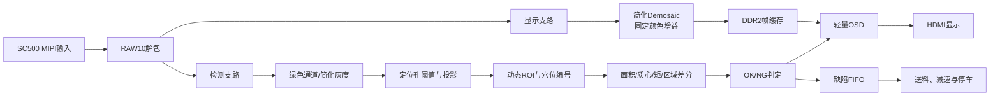

# FPGA资源预算与代码优化规范

> 适用项目：国产FPGA载带元件智检仪  
> 目标器件：安路 PH1P35MDG324  
> 目的：防止直接堆叠官方例程造成资源不足或时序失败，作为后续人工和AI编写、审查RTL代码时的强制约束。  
> 修订日期：2026-09-07。A视频识别、B连续检测、C停车闭环；下文算法按所属版本启用，不要求A版全部实现。
> 数据来源：官方 Lab 1、Lab 2、Lab 3 自带的布局布线面积报告、层级资源报告和最终时序报告。

## 1. 核心结论

本项目存在资源和时序风险。Lab 1能运行不证明新增ROI、特征、OSD、FIFO及运动模块后仍能闭合；每次模块集成都要保存资源与布局布线报告。错误地堆叠官方例程会显著放大风险。

正确策略为：

> **以 Lab 1 为唯一工程底座；Lab 2 和 Lab 3 只参考接口时序、模块插入位置和实现思路，边缘检测、OSD及项目算法必须按需求重新设计轻量版本。**

禁止将 Lab 1、Lab 2、Lab 3 的功能模块原封不动叠加到一个工程中。

## 2. PH1P35资源与官方例程实测

官方布局布线报告显示，PH1P35MDG324主要资源包括：

| 资源 | 总量 |
|---|---:|
| Slice | 21216 |
| Slice寄存器 | 42432 |
| ERAM | 108 |
| DSP | 40 |
| PLL | 6 |
| MIPI RX硬核 | 2 |

三个官方例程的布局布线结果如下：

| 工程 | Slice | Slice占用率 | 相对Lab 1增加 | LUT6 | 寄存器 | ERAM | DSP | 最差建立时序余量 |
|---|---:|---:|---:|---:|---:|---:|---:|---:|
| Lab 1：MIPI＋ISP＋DDR2＋HDMI | 12187 | 57.44% | — | 9830 | 13318 | 31 | 8 | 0.629 ns |
| Lab 2：增加边缘检测 | 15573 | 73.40% | 3386 | 11339 | 17805 | 31 | 8 | 0.234 ns |
| Lab 3：增加完整OSD | 14933 | 70.39% | 2746 | 12792 | 13369 | 31 | 9 | 0.121 ns |

若用简单增量估算直接合并Lab 2和Lab 3：

```text
12187 + (15573 - 12187) + (14933 - 12187) = 18319 Slice
18319 / 21216 ≈ 86.35%
```

这还没有加入定位孔、动态ROI、质心、角度、极性、缺陷FIFO和运动控制，因此直接合并风险很高。

注意：上述86.35%只是用于判断风险的增量估算，实际合并结果会受综合优化和布局打包影响，最终必须以TD布局布线报告为准。

## 3. 当前资源瓶颈判断

当前主要瓶颈是：

- Slice和组合逻辑；
- 高速像素时钟域的时序余量；
- 不合理映射到普通寄存器的图像缓存。

当前相对充足的是：

- ERAM：Lab 1只使用31/108，约28.7%；
- DSP：Lab 1只使用8/40，约20%；
- 普通寄存器总量仍有余量。

总体优化方向：

> **把行缓存、字体、模板和FIFO放入ERAM；把乘法放入DSP；减少大型组合判断、普通寄存器阵列和像素级除法。**

## 4. 官方例程的主要高占用模块

### 4.1 自动白平衡AWB

Lab 1层级报告中的AWB大约使用：

| 资源 | 数量 |
|---|---:|
| 逻辑LUT | 1647 |
| 加法/进位资源 | 2264 |
| 寄存器 | 6044 |
| ERAM | 10 |
| DSP | 8 |

其中两个并行除法器消耗较大。

本项目使用固定机位、固定光源、固定曝光和固定工作距离，不需要让白平衡持续大幅变化。自动参数漂移还可能造成同一种元件前后特征不一致。

处理原则：

- 各版本在验证后优先采用固定曝光、固定传感器增益和固定RGB增益；
- 需要自动白平衡时，只在一帧结束后更新一次参数；
- 两个颜色比例计算应共享一个顺序除法器，或采用倒数查表；
- 禁止在像素有效期间放置大规模组合除法；
- 删除AWB后必须重新验证显示颜色和极性特征，不能只看资源下降。

### 4.2 Lab 2全帧边缘检测

Lab 2的`edge_detect_96`约增加4487个寄存器，但ERAM数量没有增加。源码中的两行缓存使用普通寄存器数组，并在复位时循环清零，导致存储器没有有效映射到ERAM。

处理原则：

- 不直接复制`edge_detect_96`作为最终检测核心；
- 行缓存必须使用安路RAM IP或可确认推断为ERAM的代码模板；
- 禁止在复位逻辑中逐地址清空整块行缓存；
- 使用行有效计数屏蔽上电后的无效行，不依赖清空RAM内容；
- 定位孔优先采用阈值、投影、面积和间距约束；
- 空穴、偏位和极性优先采用ROI统计，不依赖完整全帧Sobel；
- 如果赛题演示需要边缘模式，另做可旁路的轻量版本，并单独测量资源。

### 4.3 Lab 3完整OSD

Lab 3中的`hdmi_mixer`大约使用：

| 资源 | 数量 |
|---|---:|
| 逻辑LUT | 2855 |
| 加法/进位资源 | 85 |
| 寄存器 | 219 |
| DSP | 1 |

其功能包含安路Logo、中英文字符、动态计数和大量坐标判断。其中`anlogic_logo_rom.v`约298 KB，使用大型`case`组合ROM实现，不适合直接放入本项目。

处理原则：

- 必须保留可辨认安路Logo；按当前版本保留固定ROI/穴位框、判定文字和必要统计；
- 不直接复制大型case组合Logo ROM；用小尺寸位图或ERAM实现同一安路标识，删除无关演示字符；
- 字体使用8×16或其他小字模，优先映射到ERAM；
- OSD坐标判断分级、流水，不写成一个超长组合逻辑块；
- OSD至少设计2～3级流水，并同步延迟DE、HSYNC、VSYNC和像素数据；
- OSD必须可旁路，关闭后原始视频链路仍能工作。

## 5. B/C版可扩展系统架构

A版从官方ISP取已确认格式的像素流，在固定ROI完成存在/空穴统计并叠加结果和Logo。下图包含B/C和可选特征，不是A版全部必做。



设计原则：

- 显示支路负责画面质量；
- 检测支路负责低资源、固定延迟的特征计算；
- 检测结果以低速事件形式送到OSD和运动控制；
- 不让OSD参与高速检测数据路径；
- 不为了检测先生成完整复杂边缘图。

## 6. 各功能的低资源实现方法

### 6.1 定位孔

推荐：

- 固定定位孔搜索带；
- 灰度阈值；
- 行列投影；
- 连续宽度、面积和间距约束；
- 进入/离开迟滞状态机；
- 孔中心和实时节距输出。

不推荐：

- 全帧连通域标签；
- 全帧Sobel后再找孔；
- 大量形态学级联；
- 依赖DDR读取整帧后处理。

### 6.2 空穴

在穴位ROI内统计前景面积或已验证的强度特征。是否用“面积低于阈值”取决于前景定义及样本分布，不能在黑元件/黑载带上无验证套用。只需比较、累加及明确的帧/ROI结束脉冲。

### 6.3 中心偏位

像素流中只累加：

- `N = Σ1`；
- `Sx = Σx`；
- `Sy = Σy`。

质心计算：

```text
Cx = Sx / N
Cy = Sy / N
```

除法只在ROI结束后执行一次。多个穴位共享一个顺序除法器或倒数查表，禁止每个穴位复制一套大除法器。

### 6.4 旋转角度

在ROI内累加二阶矩，例如`Σxx`、`Σyy`和`Σxy`。ROI结束后由共享后处理单元计算方向。

要求：

- 坐标先减去ROI中心，降低乘法位宽；
- 乘法优先映射到DSP；
- 角度可采用查表或区间比较；
- 不在像素有效路径中直接计算反正切。

### 6.5 极性

根据最终主样品选择最简单稳定的视觉特征：

- 二极管：色带左右区域差分；
- 钽电容：极性条区域差分；
- LED：固定区域的内部结构差分或小模板分数。

优先使用区域和、亮度差、颜色通道差或小模板。A/B/C基线不引入大型神经网络；方向特征通过验证后才启用。

### 6.6 多穴位并行

可见穴位数由有效视场和特征像素数实测决定。即使采用多穴位，也不应按穴位数量复制完整检测器；A版可先单穴固定ROI。

推荐：

- 一套像素特征提取逻辑；
- 每个可见穴位保存独立的面积、坐标和状态累加器；
- 用`pocket_id`选择需要更新的累加器；
- 除法、角度和模板计算共享一套后处理单元；
- 后处理尽量安排在行消隐、帧消隐或ROI间隙执行。

## 7. 官方例程的使用边界

### 7.1 Lab 1：工程底座

优先保留：

- SC500CS初始化；
- MIPI D-PHY接收；
- CSI数据解包；
- DDR2控制器；
- HDMI发送；
- 时钟、复位和跨时钟处理；
- 官方引脚与时序约束。

除非已经确认资源确实无法满足，否则不要优先重写MIPI、DDR2和HDMI底层。

### 7.2 Lab 2：参考接口和流水线

可以参考：

- 图像处理模块插入位置；
- 视频流`valid/user/last/ready`传递；
- 灰度转换和邻域处理顺序；
- 流水线延迟对齐。

不得直接视为最终项目算法。

### 7.3 Lab 3：参考显示叠加方法

可以参考：

- HDMI像素坐标生成；
- 像素数据与同步信号对齐；
- OSD颜色覆盖逻辑。

保留安路Logo，重做轻量存储实现；不复制大型组合ROM、大字体和无关演示内容。

## 8. RTL编码强制规范

### 8.1 位宽

- 所有计数器和累加器必须按最大值计算位宽；
- 不无条件使用32位或64位整数；
- 坐标、面积、乘积和累加值分别定义明确位宽；
- 有符号和无符号运算必须显式声明；
- 每次截位、舍入和饱和处理必须写注释。

### 8.2 除法、乘法和复杂函数

- 像素有效路径禁止使用`/`实现变量除法；
- 常数除法使用移位、乘倒数或工具确认可优化的形式；
- 变量除法集中到共享顺序单元；
- 乘法优先确认是否进入DSP；
- 平方、倒数和角度优先采用查表；
- 不在高速像素路径中实现平方根、浮点和反三角函数。

### 8.3 RAM、ROM和FIFO

- 行缓存、模板、字体和队列优先使用ERAM；
- RAM数组不得在复位中使用`for`循环逐项清零；
- 使用有效标志屏蔽未初始化RAM数据；
- 综合后必须检查该数组是否真的被识别成ERAM；
- 缺陷事件FIFO保存事件字段，不保存整幅图像；
- FIFO深度和字段位宽必须依据最大连续NG数量计算。

### 8.4 流水线与时序

- 加法树、比较树和多级条件判断必须流水；
- 每一级流水同时延迟`valid`和对应编号；
- 视频数据、DE、HSYNC、VSYNC必须保持相同延迟；
- 高扇出控制信号需要寄存或局部复制；
- 不能通过放宽错误约束或忽略时序违例来“通过”工程；
- 每增加一个功能都检查最终布局布线时序，不只看综合结果。

### 8.5 跨时钟域

- 像素时钟、DDR用户时钟、HDMI像素时钟和电机控制时钟不得直接互连多位数据；
- 单比特脉冲使用同步、翻转握手或脉冲展宽；
- 多位数据使用异步FIFO或稳定握手；
- 检测结果跨到HDMI域时，应传送完整事件或稳定寄存器快照；
- 所有CDC接口在模块说明中注明源时钟和目标时钟。

### 8.6 参数和模块接口

- 每个算法模块必须支持旁路；
- 阈值、ROI、允许偏移和角度范围使用参数或寄存器配置；
- 模块输入输出必须包含明确的有效信号；
- 不允许子模块随意读取其他模块内部寄存器；
- 穴位编号、帧号和判定结果必须随流水线同步传递；
- 调试输出使用统一选择器，不为每种模式复制完整视频通路。

### 8.7 AI生成代码特别要求

AI生成或修改RTL时，必须同时给出：

1. 输入输出时序说明；
2. 每个寄存器和累加器的位宽依据；
3. 预计使用LUT、寄存器、ERAM或DSP的模块部分；
4. 流水线总延迟；
5. 跨时钟域处理方式；
6. 可旁路和复位行为；
7. 对应仿真测试点；
8. 综合后需要检查的资源映射结果。

禁止AI直接复制大段官方Lab 2或Lab 3代码后宣称“已优化”，也禁止只根据代码行数判断资源大小。

## 9. 项目内部资源门槛

资源余量和时序分别判断，不能以资源低掩盖负时序，也不能只看一个WNS数字忽略未约束路径。

- 资源建议：Slice≤70%较宽裕，70%～80%须检查增量和余量，>80%暂停加功能并评估削减；这些是内部目标，不是器件绝对限制或赛题评分门槛。
- 时序必须在正确时钟/I/O约束下满足建立与保持要求。任何违例或未解释的未约束关键路径都不能作为已通过版本；正余量仍须记录具体时钟域。
- 0.3～0.5 ns余量可作优化目标，不能通过放松错误约束获得。ERAM与DSP建议留余量，最终以器件容量和布局布线为准。
- 每个A/B/C交付版本都保存资源报告、时序报告、模块增量和退回镜像。

## 10. 分版本资源检查点

| 阶段 | 必须检查 |
|---|---|
| 官方Lab 1复现 | 本机资源、时序、输入模式和冷启动，旧官方报告仅作参考 |
| A版每个新增模块 | 固定ROI、灰度/二值、存在判定、轻量Logo的增量；视频稳定性 |
| B版每个新增模块 | 孔位、相对编号、动态ROI、帧匹配和按需方向特征的增量 |
| C版每个新增模块 | FIFO深度、高水位、跨域运动控制和复检的增量 |
| 可选扩展 | 多帧/双光场/第二配方每项单独评估，不前置A版 |

每次记录LUT、Slice、FF、ERAM、DSP、建立/保持余量、约束覆盖和报告位置，填写01模板。优化AWB前后需同时验证画质及分类，不为降低资源无条件重写官方链路。

## 11. 资源超限时的处理顺序

按以下顺序处理：

1. 保留安路Logo并改为小尺寸位图/ERAM；删减无关大图片和复杂OSD，仅保留本版本必要框、文字和统计；
2. 将动态AWB改为固定增益或共享顺序计算；
3. 用ROI统计替代全帧边缘和形态学级联；
4. 将寄存器行缓存、字体、模板和FIFO改为ERAM；
5. 让多个穴位共享除法、角度和模板后处理单元；
6. 缩小无必要的数据位宽；
7. 给长组合逻辑增加流水级；
8. 检测支路采用2倍抽样，显示支路仍保留完整画面；
9. 暂停非当前判定必需的多帧、第二配方、复杂中文界面和数据导出；若当前判定依赖多帧，删减后须重验误报/漏检；
10. 最后才考虑降低摄像头或HDMI分辨率；
11. 只有在以上方法仍无效时，才评估重构DDR或HDMI链路。

## 12. 每次提交前的代码审查清单

- [ ] 该功能是否真的需要全帧处理？
- [ ] 是否可以只处理定位孔搜索带或穴位ROI？
- [ ] 是否复制了完整Lab 2/Lab 3模块？
- [ ] RAM、ROM和FIFO是否映射到ERAM？
- [ ] 是否存在复位时循环清空大数组？
- [ ] 是否存在像素路径变量除法、平方根或反三角函数？
- [ ] 多个穴位是否错误地复制了多套复杂后处理？
- [ ] 数据位宽是否有计算依据？
- [ ] 乘法是否进入DSP？
- [ ] `valid`、编号和像素是否保持延迟一致？
- [ ] 跨时钟域是否使用了正确的同步或FIFO？
- [ ] 模块是否可以旁路？
- [ ] 是否保存了修改前后的资源和时序报告？
- [ ] 最终布局布线是否无时序违例？
- [ ] 当前资源状态是绿色、黄色还是红色？

## 13. 当前推荐执行方案

1. 在本机复现Lab 1资源、时序与1024×600视频基线，保留官方底层。
2. 写检测RTL前填写04接口表，明确每拍像素数、顺序、valid/sof/eol、ROI生成时刻和结果/显示帧关系。
3. A版先固定ROI、单帧存在/空穴识别、处理视图、轻量安路Logo与固化冷启动。
4. B版再接孔位相位、相对编号、失锁重同步、运动检测；动态显示实施时验证DDR帧匹配。
5. C版再接去重NG FIFO、高水位和溢出处理、停车与复检。
6. 每个模块集成后做综合和布局布线，记录资源增量与正确约束下的建立/保持时序，同时验证视频。
7. 多帧由单帧效果和时间窗口决定；双光场、第二配方等按需扩展，不作为A版前置。

详细顺序以00执行路线为准，接口与异常规则以04约定为准。
