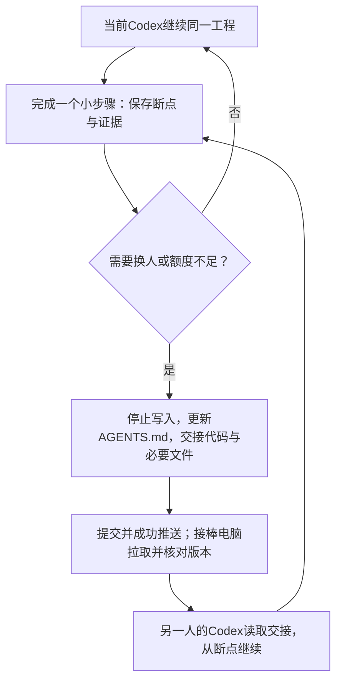
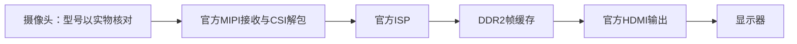
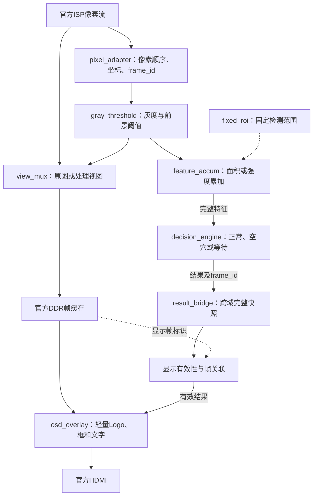
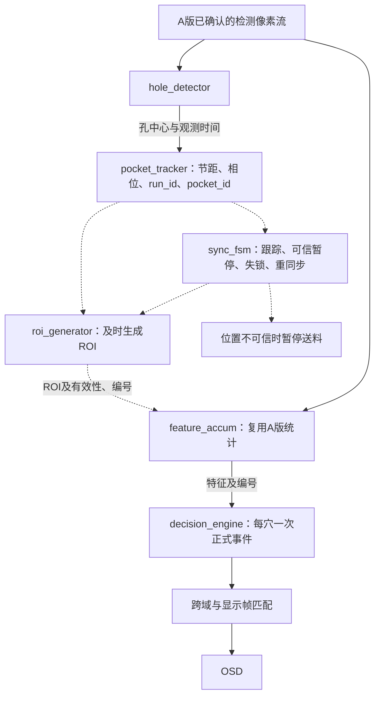
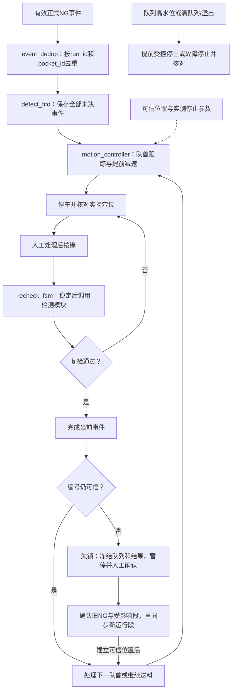
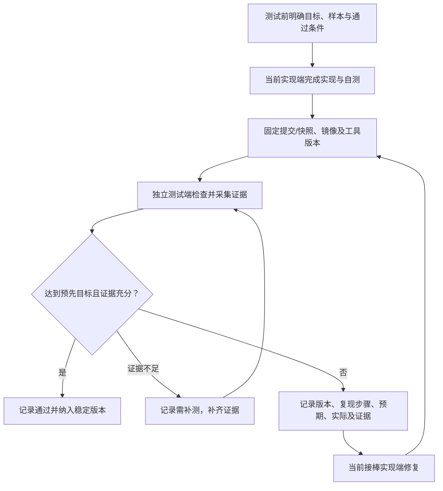

# 系统框架与Codex接力协作

> 更新：2026-09-28。两人轮流用各自的Codex接续同一工程，一人利用AI独立测试和挑刺。A/B/C只表示项目阶段。本文的模块名是建议职责划分，不代表已有RTL源码或已经验收。

## 1. 三个阶段怎样推进

| 阶段 | 对应步骤 | 必须形成的能力 |
|---|---|---|
| A 视频识别 | 1—4 | 官方视频稳定、视场实测、固定ROI正常/空穴单帧识别、处理视图、安路Logo、结果文字和固化启动 |
| B 连续检测 | 5—6 | 运动成像与电机干扰验证、定位孔相位、运行段内相对编号、动态ROI、失锁暂停和重同步 |
| C 停车闭环 | 7—8 | 实测停止距离、NG去重队列、高水位与溢出处理、正确穴位停靠、人工处理和复检恢复 |

两名实现人员顺序推进当前阶段，不分成“一个人做A、另一个人做B”。偏位、角度、极性、多帧和双光场按实测需要扩展，不是A版前置。

执行顺序见[00开发路线](00_分阶段开发与逐级验证路线.md)，实现约束见[02资源规范](02_FPGA资源预算与代码优化规范.md)，接口与异常见[04约定](04_FPGA接口与异常处理约定.md)，最新断点见[根目录AGENTS.md](../AGENTS.md)。

## 2. 人员怎样接力

| 角色 | 负责什么 | 交付什么 |
|---|---|---|
| 当前实现端：其中一人的Codex | 本轮需要的算法、RTL、顶层、约束、仿真、编译、集成和镜像管理 | 代码与工程、验证结果、准确断点和下一条操作 |
| 下一实现端：另一人的Codex | 额度不足或换人时接手当前任务，继承方案和成果，接管全部实现职责 | 从交接断点继续推进，并持续更新交接 |
| 独立测试端：第三人及其AI | 提前确定验收条件，独立检查代码、报告、样品与实物结果，提出可复现问题并复测 | 测试用例、证据、问题单和阶段结论 |
| 人工操作 | 接线、下载、样品真值确认、测距、换样、现场观察和证据采集；由当轮人员明确承担 | 可核对的实物事实与人工复核结果 |

当前实现端和下一实现端是轮换状态，不是固定专业分工。测试端不通过悄悄修改被测代码或降低目标来使结果通过。

Git同步按当前授权执行，未推送要明确说明。额度突然耗尽可能无法收尾，因此每完成小步骤就写检查点；人应保存未提交及必要未跟踪文件，不能只传AGENTS.md。Git不传送聊天上下文、本机进程或工具安装。

## 3. 一块板子怎样安排

- 同一时间只有一个实现端修改接力工程；额度恢复也不能绕过交接自行改回旧副本。
- 开发窗口用于联调。验收窗口固定代码提交或快照及镜像，由测试端执行独立验收，不边测边换版本。
- 同一时间只有一名操作人下载、固化、断电或接线；MIPI排线不带电插拔。
- 算法分析、代码检查、定点对照与仿真尽量离线完成。换电脑不要求换板卡连接位置；无板卡访问时明确记录未上板，由现场操作人提供证据。
- 上板记录绑定Git提交或工作区快照、TD版本、镜像路径及SHA-256、测试条件和原始证据。含未提交修改时不能只用HEAD表示被测版本。

## 4. 先跑通官方视频底座

步骤1先以Lab 1的1024×600配置运行，不先重写MIPI、DDR和HDMI。核对板卡、摄像头、约束和本机工程；实测输入模式与帧率，保存资源与正确约束下的建立/保持时序报告。连续运行30分钟记录异常，固化后验证断电自启动。

“能看到画面”只是初步跑通。无错误计数器可以记录人工观察范围，不能宣称零丢帧；显示刷新率不能代替相机输入帧率。

## 5. A版RTL：从ISP分出检测支路

图中实线传送像素或标注的特征/结果，虚线传送ROI、配置和帧标识。处理视图在写DDR前选择是一种建议接法，实际插入点与吞吐须按源码及04接口表确认。

- 原图与处理图切换前补齐流水延迟，像素及valid/sof/eol、frame_id同步传递。
- 写RTL前确认数据格式、PPC、每lane顺序、坐标、回压和时钟域。不能凭信号名称猜测实际语义。
- 固定ROI只决定哪些像素参与统计，不要求先找到定位孔。ROI未完整采样时不能直接判空穴。
- 换样后旧结果作废，稳定并完成新采样后才有效。A版明确静态判定策略；B版动态框必须通过显示帧匹配验证。
- 多位跨域数据采用异步FIFO或稳定握手，不能逐位同步后拼接；OSD不得反过来控制采样判定时刻。

## 6. 算法对应哪些模块

| 阶段/功能 | 建议算法 | RTL实现要点 |
|---|---|---|
| A 灰度与前景 | 从确认后的像素格式得到灰度，以样本验证暗目标、亮目标或区间阈值 | `gray_threshold`；颜色顺序、定点系数、截位/舍入与金标准一致 |
| A 正常/空穴 | 固定ROI内前景面积N或亮度和S，和预先确定的阈值/区间比较 | `feature_accum`、`decision_engine`；累加清零、结束拍锁存和有效性明确 |
| B 定位孔 | 固定搜索带、阈值、行列投影、宽度/面积/间距约束及进入离开迟滞 | `hole_detector`；避免为了找孔先做复杂全帧处理 |
| B 编号与ROI | 孔节距P0、穴位节距P1、相位与方向建立可信位置 | `pocket_tracker`、`roi_generator`、`sync_fsm`；丢失可信位置就暂停 |
| 可选偏位 | N、Σx、Σy求质心 | ROI结束后共享顺序除法；N为零时无效，先定义正常容差 |
| 可选角度 | 二阶矩与共享后处理 | 坐标中心化，乘法优先DSP，避免像素路径反正切 |
| 可选极性 | 指定区域亮度/颜色差分或小模板 | 实测标记清楚、样本判据成立后启用 |
| C 事件与控制 | 事件键去重、FIFO、停靠及复检状态机 | 容量和控制参数由停止距离与最坏事件量确定 |

面积N为ROI内前景像素数，S为ROI内灰度和。不能默认“面积小就是空穴”，具体方向由真实样本决定。ROI含M个像素时，N位宽为⌈log₂(M+1)⌉；8位灰度和位宽为⌈log₂(255M+1)⌉。同拍多像素按各自掩码累加，不能只检查一组坐标。

用独立物理样本分开调参和验收，连拍同一穴位不算新样本。像素路径不使用变量除法；多个穴位共用特征与后处理逻辑，分别保存累加状态。行缓存、字体、模板和FIFO优先ERAM，综合后确认实际映射。

## 7. B版RTL：定位信息控制ROI，像素直接进入特征计算

动态ROI必须在像素使用前有效。可选扫描先行加必要缓存、上帧预测或ROI缓存，记录误差边界；不能用本帧结束后才算出的孔位去处理已经流走的像素。

编号是运行段标识run_id加相对穴位号pocket_id。受控暂停只有位置仍可信才能保留编号；遮孔、视频中断、滑移或手动移动超过可信范围时失锁。重同步前人工确认受影响带段及旧NG，再建立新run_id。

## 8. C版整机与事件闭环

整机为：载带和补光形成成像条件，摄像头输入FPGA，FPGA输出HDMI；FPGA经驱动器控制送料电机带动载带，按键用于处置后复检。下图包含RTL控制及外部人工操作。

- 距离预算：检测到处置距离 ≥ 速度×最坏判定及控制时间＋最坏停止距离＋误差余量。起点为首次有效采样位置，不预设固定穴位数足够停车。
- 事件保存编号、缺陷类型、采样时间/位置、有效性和处置状态。复检失败保留当前事件，不重复入队。
- 高水位提前停车并预留制动期间新增NG及在途判定容量；满队列/溢出故障停止，标记记录可能不完整并人工核对，不静默丢弃。
- 失锁可在任意运动状态发生，禁止沿用旧号停靠。旧NG经复检通过或明确人工隔离记录后才结束，不因重同步清空。
- 结果送OSD需跨域与帧关联；送运动控制使用采样时间/位置，不以延迟的屏幕画面控制停车。

## 9. 模块由谁实现和验收

所有模块由当前接棒的实现端负责实现或接入；换人后整体职责转移，不按模块绑定个人。官方底层优先复用，独立测试端检查对应证据。

| 模块 | 阶段 | 独立验收重点 |
|---|---|---|
| `design_top_wrapper`、`clock_reset`、`config_registers`、`camera_cfg` | A起 | 接口、时钟/复位/CDC、约束、配置与冷启动 |
| 官方MIPI/CSI/ISP/DDR/HDMI | A底座 | 视频实时性、输入模式、连续稳定、本机资源时序 |
| `pixel_adapter`、`fixed_roi` | A | PPC顺序、坐标、帧行边界、valid间断和ROI边界 |
| `gray_threshold`、`feature_accum`、`decision_engine` | A | 定点向量、累加位宽、正常误报/空穴漏检、换样与无效帧 |
| `view_mux`、`osd_overlay`、`result_bridge` | A起 | 处理视图、Logo、旁路、同步延迟和结果有效性 |
| `hole_detector`、`pocket_tracker`、`roi_generator`、`sync_fsm` | B | 物理编号、预测误差、遮孔/丢帧/滑移、可信暂停和重同步 |
| 显示帧匹配 | 动态显示启用时 | 检测结果与DDR读出画面属于正确帧，字段原子更新 |
| `event_dedup`、`defect_fifo` | C | 单NG、相邻NG、全NG、去重、高水位、满队列与旧事件保留 |
| `motion_controller`、`recheck_fsm` | C | 驱动电平脉宽、实测位移、停止距离、停错穴、复检失败与恢复 |

## 10. 实现与独立测试怎样闭合

人确认实物真值和人工复核状态，AI按[01模板](01_阶段验收记录模板.md)写入逐轮记录。复测不覆盖失败记录。未执行写未测，缺证据写待补证据；代码生成、编译通过、仿真通过和上板通过分别记录。

## 11. 每次接力的最小交付包

1. 当前分支、代码基线、已提交/已推送状态，以及未提交和必要未跟踪文件清单。
2. 本轮目标、实际修改文件、已完成步骤及证据、失败原因和未解决问题。
3. 精确停在哪一步，接棒后第一条操作是什么；尚在运行的进程、日志和设备状态。
4. TD及依赖版本、工程与镜像位置；共享证据的位置，不能只给另一台电脑无法访问的绝对路径。
5. 更新根目录AGENTS.md的最新交接和历史，接棒者核对后继续。当前额度恢复时也必须按同样流程接回。

接口变化先更新04约定；每新增模块检查资源、布局布线时序及视频。图示省略的硬件语义以源码与实测为准，不通过忽略违例或改变测试答案达到通过。

## 12. 尚需实测或核对的条件

- 实际板卡、摄像头、镜头、TD工程及当前有效镜像。
- 像素格式、PPC、像素顺序、valid/sof/eol、回压与跨域方式。
- 主样品与载带规格、有效视场、固定与重复装夹、ROI及分类阈值。
- B版P0/P1相位、送料方向、容许观测间隔、定位误差和重同步条件。
- C版驱动接口、速度、最坏停止距离、队列容量、处置窗口和复检恢复条件。

本文修订只说明架构和接力方式，不代表上述条件已实测或任何阶段已通过。
