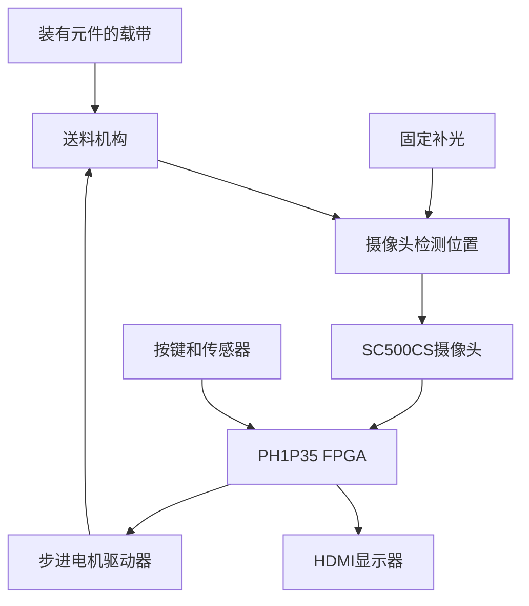
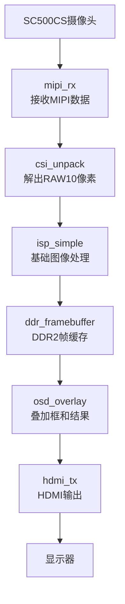
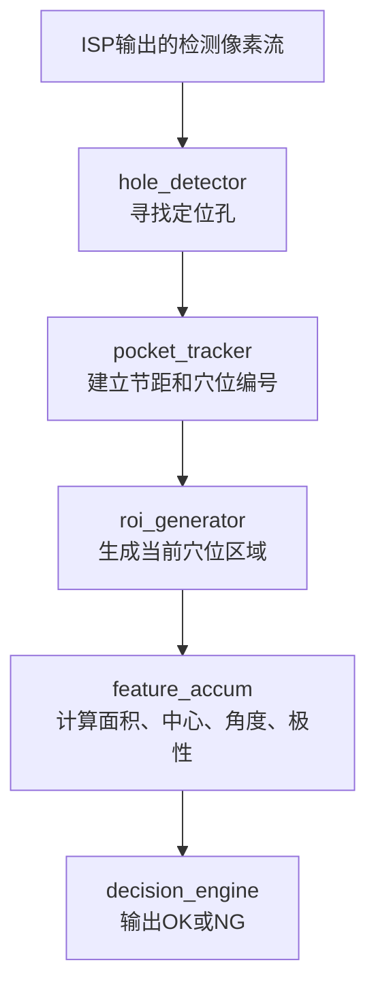
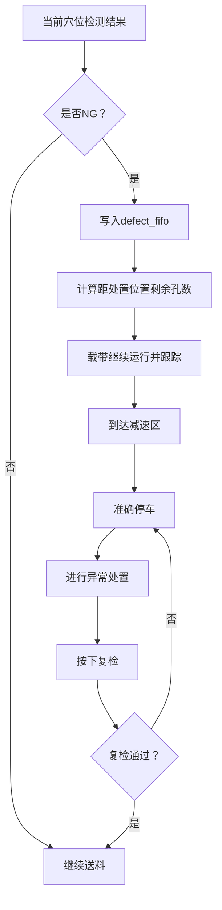
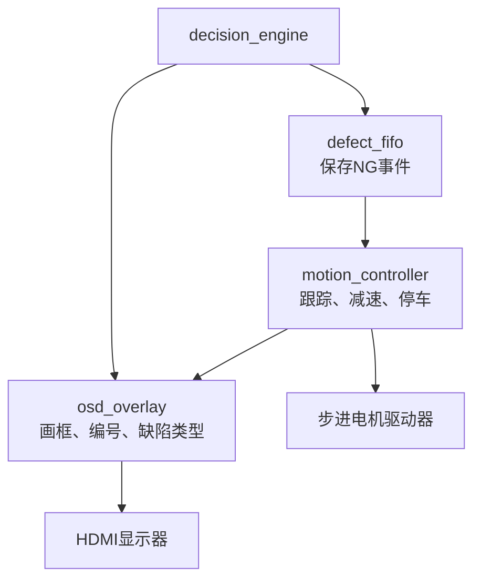
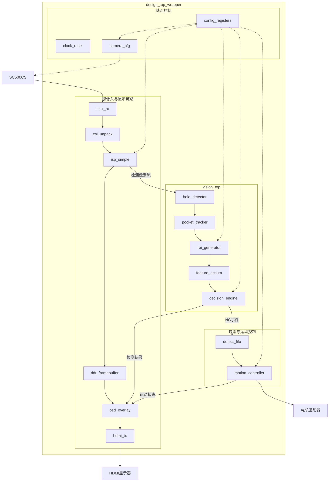
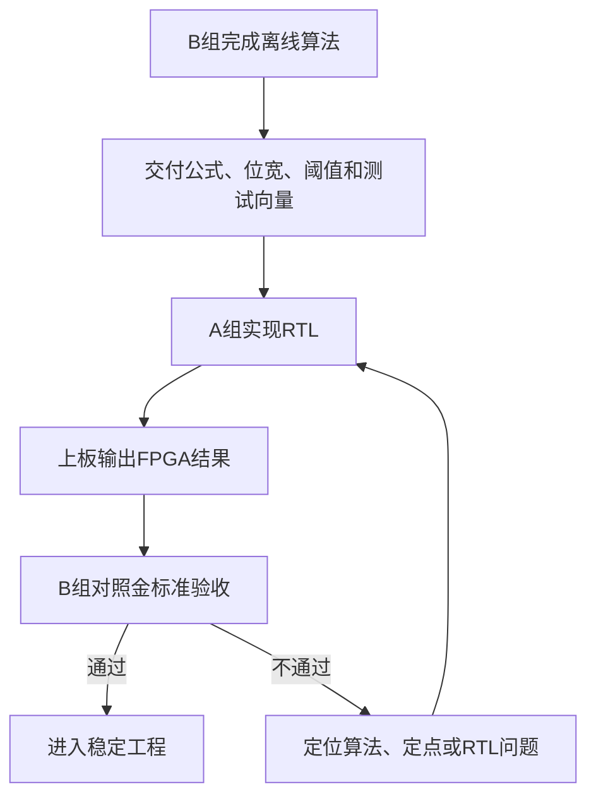
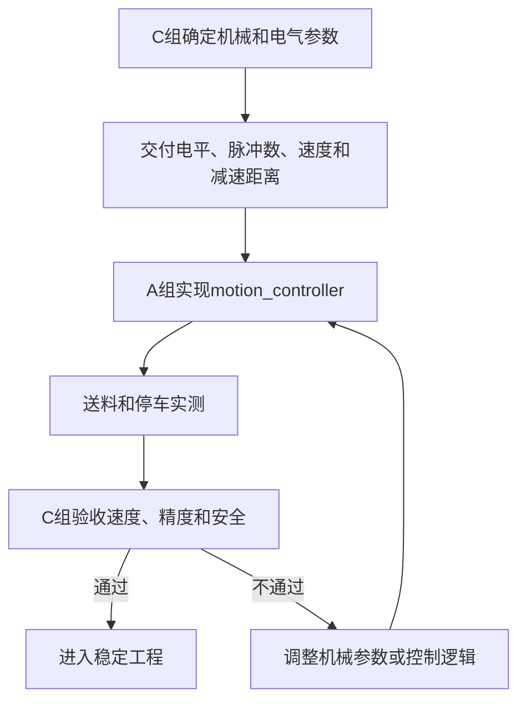

# 系统框架与模块负责人

> 本文只用小流程图表达模块关系。负责人、输入输出和实现方式单独放在表格中，不再把所有信息塞进一张大图。

## 0. 交付版本与团队分工

2026-09-07修订。版本A/B/C分别是视频识别、连续检测、停车闭环；团队A/B/C组仍分别负责FPGA集成、视觉测试、机械硬件，两者不要混用。

| 版本 | 本版模块 |
|---|---|
| A | 官方视频链路、固定ROI、单帧存在判定、处理视图、安路Logo和结果文字、固化启动 |
| B | 孔位相位、本次运行相对编号、失锁暂停/重同步、动态ROI及实际采用的帧匹配 |
| C | NG去重队列、高水位/满队列处理、运动停靠、处置复检 |

后续完整图表示B/C目标架构。A版可以直接从ISP进入固定ROI和存在判定，无须先实现孔位、角度、极性或电机。像素流应旁路传入特征模块，图中的孔位/ROI连线也包含控制元数据，不能理解成凭孔坐标重新生成像素。

## 1. C版整机是怎么工作的

简单理解：

1. 送料机构带着载带向前运动；
2. 摄像头持续拍摄载带；
3. FPGA逐穴检测并编号；
4. 结果显示在HDMI画面中；
5. 出现NG时，FPGA继续跟踪该穴位；
6. FPGA按实测制动预算提前减速，把可信编号对应的穴位停到处置位置；失锁时暂停并重新确认基准。

## 2. 图像是怎么进入显示器的

这条链路以官方Lab 1为底座。A组先保证它单独稳定，再接入检测模块。

## 3. B/C版是怎么检测每个穴位的

各模块的关系为：

- `hole_detector`回答“定位孔在哪里”；
- `pocket_tracker`回答“这是第几个穴位”；
- `roi_generator`回答“应该检查画面中的哪一块”；
- `feature_accum`回答“元件的面积、中心、角度和极性特征是多少”；
- `decision_engine`根据配方阈值给出最终OK/NG。

## 4. C版检测结果是怎么处理的

这里最重要的是：

> 正常NG按可信相对编号入队并提前减速停靠；失锁、队列高水位或溢出走异常暂停流程，不盲目继续送料。完整规则见04。

## 5. C版检测结果同时送到哪里

检测结果分成两条用途：

- 一条送给OSD，让操作者看见结果；
- 一条送给缺陷FIFO和运动控制，用于跟踪与停车。

## 6. RTL内容总图

这一张图表示`design_top_wrapper`内部的全部主要RTL模块及数据关系：

图中：

- 实线表示图像、检测结果或运动数据；
- 虚线表示参数配置；
- `vision_top`内部包含定位孔、穴位编号、动态ROI、特征计算和OK/NG判定；
- `design_top_wrapper`只负责连接，不在顶层堆放算法细节。

## 7. 三组分别负责什么

### A组：FPGA与系统集成

负责：

- 官方Lab 1视频链路；
- FPGA顶层；
- 时钟、复位和跨时钟；
- 所有RTL模块的实现或接入；
- 资源、时序和bitstream；
- 最终工程合并。

A组是唯一可以合并`design_top_wrapper`、引脚约束和时序约束的小组。

### B组：视觉与测试

负责：

- 元件、镜头和光源实验；
- 离线算法；
- 特征公式和参数阈值；
- 浮点/定点金标准；
- 带物理穴位真值、制造方法和独立测试划分的图片与测试向量；
- 视场、标记像素数和支架重复装夹验证；
- 独立验收FPGA检测结果。

B组定义算法“应该得到什么结果”，A组负责把它实现成RTL。

### C组：机械与硬件

负责：

- 送料机构、导轨和支架；
- 步进电机、驱动器和电源；
- 补光、传感器、按键和接线；
- 速度、加速度和减速参数；
- 停车精度、卡带和电气安全测试；
- 首次接电机时的视频干扰、供电/回流及启停试验。

C组定义机械“需要什么控制信号”，A组负责实现`motion_controller`。

## 8. 模块负责人表

| 模块 | 它解决的问题 | 主负责人 | 谁提供要求/验收 |
|---|---|---|---|
| `design_top_wrapper` | 把所有模块连接起来 | A组 | A组系统集成人 |
| `clock_reset` | 产生并管理时钟和复位 | A组 | 依据官方例程 |
| `config_registers` | 保存配方和控制参数 | A组 | B组提供视觉参数，C组提供运动参数 |
| `camera_cfg` | 初始化SC500、设置曝光增益 | A组 | B组提出成像要求 |
| `mipi_rx` | 接收摄像头MIPI数据 | 官方IP/A组 | A组上板验证 |
| `csi_unpack` | 解出RAW10像素 | 官方HDL/A组 | A组验证数据格式 |
| `isp_simple` | 基础图像处理和灰度输出 | A组 | B组验收图像质量 |
| `hole_detector` | 找到定位孔 | A组 | B组提供样本并验收 |
| `pocket_tracker` | 建立节距、相位和穴位编号 | A组 | B/C组核对实物位置 |
| `roi_generator` | 生成需要检查的穴位区域 | A组 | B组定义ROI范围 |
| `feature_accum` | 计算面积、中心、角度和极性 | A组 | B组提供公式和金标准 |
| `decision_engine` | 根据阈值输出OK/NG | A组 | B组独立验收 |
| `ddr_framebuffer` | 缓存图像并跨时钟 | 官方IP/A组 | A组维护 |
| `osd_overlay` | 显示框、编号、类型和统计 | A组 | B组定义显示内容 |
| `hdmi_tx` | 输出HDMI画面 | 官方IP/A组 | A组维护 |
| `defect_fifo` | 保存连续NG事件 | A组 | B组测试连续NG |
| `motion_controller` | 跟踪、减速、停车和继续 | A组 | C组定义接口并验收 |

## 9. B组怎样与A组对接

## 10. C组怎样与A组对接

## 11. 统一修改规则

1. 顶层、引脚约束和时序约束只由A组系统集成人合并。
2. B组不直接修改FPGA顶层，通过算法交付包与A组对接。
3. C组不直接修改视觉编号逻辑，通过硬件接口表与A组对接。
4. 接口发生变化时，先修改接口文档，再修改代码。
5. 任何模块都必须经过对应小组验收后才能进入稳定工程。
6. 流程图只说明关系；具体位宽、电平、时钟和时序单独写入接口表。

## 12. 当前还没有确定的内容

- A版编码前填04接口表：像素格式、每拍数量与顺序、valid/sof/eol和回压语义；
- 主样品和载带规格；
- 定位孔与穴位的相位关系；
- 实测视场、标记像素数决定的穴位数量；C版制动预算决定的检测至处置距离；
- 电机、驱动器和接口电平；
- 是否增加外部定位孔传感器；
- 参数通过按键还是UART修改；
- 复检和继续运行的具体按键流程。

这些内容在对应实验完成后逐项确认，当前不强行画死。

## 13. 新增接口责任

A组确认像素与时钟时序、每模块资源和布局布线报告；B组确认ROI、真值、分类判据及动态显示对应；C组确认实际位移、停止距离、干扰和驱动接口。三组共同确认失锁与旧NG处理，不以软件号相同代替实物位置核对。
