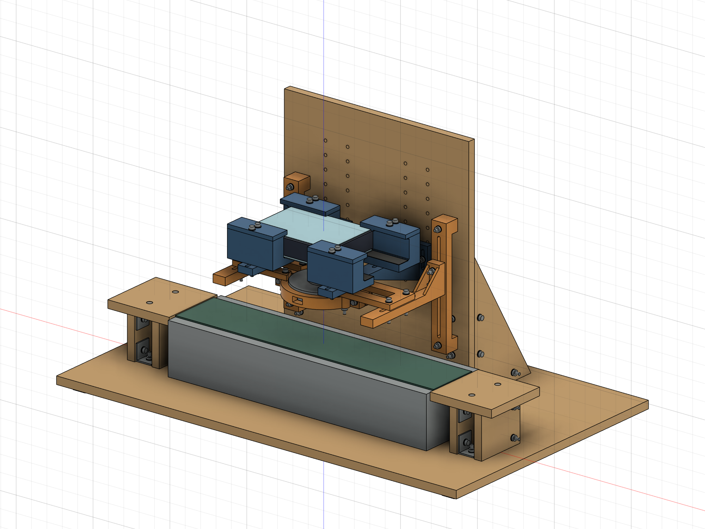
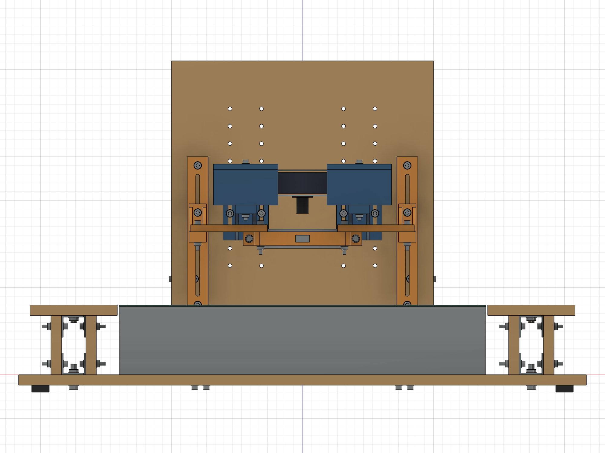
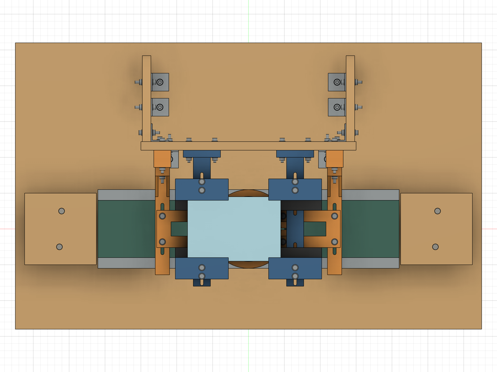
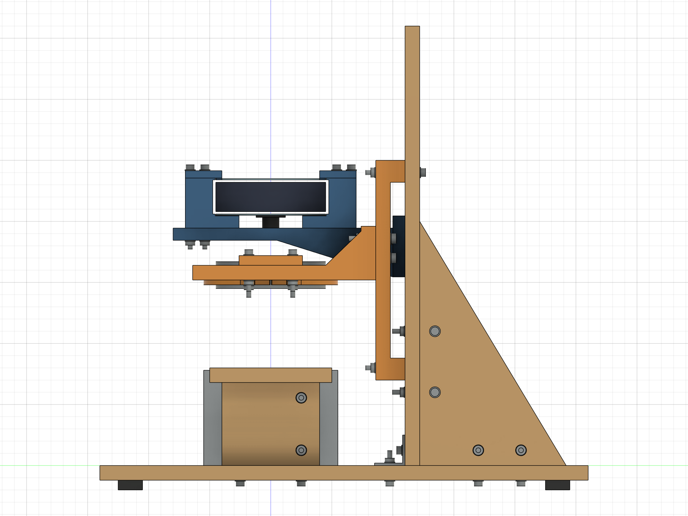

# FPGA 载带视觉检测装置 R2 · 首阶段布局审查

**试制方案，2026-09-10。仅供布局确认；未完成实物试配、承载、温升或光学验证。R1 保留。**

本目录包含 Fusion 原生参数化装配、整机 STEP 和四幅整体视图。自制零件使用草图、尺寸约束、拉伸、切除和少量放样特征；标准紧固件采用简化包络，未画螺纹。不是渲染图替代 CAD。整机当前包络为 **650×400×380 mm**（含底部 8 mm 防滑垫）。正视由前方 −Y 看向后方，俯视从 +Z 向下，右视从 +X 看向左侧。当前设计有 55 个用户参数、1244 项特征历史、348 个完全约束草图、324 个装配实体。重复件共享组件定义；P03 四个方位及 P07 左右件分开编号。

## 文件及查看

- `FPGA_Inspector_R2_Prototype.f3d`：用 Fusion 打开，可旋转、隐藏组件、查看时间线、修改用户参数。
- `FPGA_Inspector_R2_Assembly.step`：整机实体交换文件；不含 Fusion 参数历史。
- `整体视图/R2_Isometric.png`、`R2_Front.png`、`R2_Top.png`、`R2_Right.png`：原生 CAD 正交投影截图，2000×1500；不是制造工程图。
- `参数表_R2.csv`：用户参数与表达式；`evidence/`：检查数据；`scripts/`：建模和检查脚本及修正记录。
- `evidence/R2_working_checkpoint.f3d` 是中途恢复用检查点，**不是最终审查版本**。应打开文件名含 `Prototype` 的文件。

### 整体正视、俯视、右视

## 布局与 R1 修正记录

| 项目 | R2 实施结果与原因 |
|---|---|
| 木结构 | 底板 650×400×12；立板 300×360×12；两块 120×200×12 直角加强板。底板上面 Z=0，检测中心 X=Y=0，X 沿输送方向，Y 向后。立板前面 Y=110。 |
| 相机对中 | 托臂始终 X=±65。板卡中心 X=−20，镜头偏心 +20，镜头轴线仍为 X=Y=0；未增加左右滑台。 |
| 四点承托 | P02 由 64 加宽为 74，接触深度改为 19。软垫厚 0.5 为假设，螺栓位于接触区以外。 |
| 正向限位 | P02 集成上下亚克力 Y 止挡、板外硬支脚；P03 下伸 X 止挡并在上亚克力上方留 0.5 间隙。压紧力经板外支脚传递。四角止挡交界原有 3 mm³ 重叠已消除。 |
| 相机高度 | 根部加宽 52，双侧根部螺栓中心在加强筋之外；分档 20，微调槽总长 28、宽 4.5。上下档衔接。 |
| 灯架 | P04 平板、两端垫高脚、12 深开放背通道；P05 双螺栓连接，无复杂滑块。P05 筋前端由 Y=28 后退到 Y=45，给连接板前后运动让位。 |
| 木连接干涉 | 加强板与立板的上连接点由 Z=140 降到 Z=110，避免与低位灯架螺栓相碰；下连接点 Z=60。未增加零件。 |
| 灯圈 | P06A/B 分体外夹，通光孔保留；P07 合并为左右各一件。夹耳、直通线口/散热窗及闭合止挡保持简单。没有使用安装面未知的四个 M3 孔。 |
| 灯的操作 | 灯架高度连接采用 M4 外六角头，开放背通道侧向持 7 mm 扳手，正面紧固。夹圈螺钉从前方操作。 |
| 水平进出料 | 两端各 100×100×12 托板，距机身端面 2 mm；四片 12 厚木脚暂高 68。托板顶面与暂定带面同为 Z=80。顶面改为 M4×20 沉头螺钉，头低于板面 0.2，防止载带撞螺钉头。 |
| 固定 | 普通 25×25×25、厚 2 角码包络；实购孔位待核。只建结构连接孔，设备安装孔未臆造。底部 8 厚防滑垫让出螺钉头。 |

图示颜色仅区分木板、打印件、设备与标准件，不表示已赋予可信的材料强度数据。

## 假设与参数修改规则

| 未知项目 | 本版布局值 | 状态 |
|---|---:|---|
| 下/上亚克力厚度 | 各 1 mm | 假设，待测 |
| 承托面至组件顶部 | 30 mm | 假设；不代表实际板卡总厚度 |
| 镜头端面低于承托面 | 20 mm | 假设；镜头自身 Ø14×18.3 单独定义 |
| 实际带面高 | 80 mm | 假设；已知 80 是设备外形高度，不能作为实测带面高度 |
| 检测物高出带面 | 5 mm | 假设 |
| 拍摄距离 D | 100 mm | 从镜头端面到检测面；未做合焦验证 |
| 灯发光面距检测面 H | 60 mm | 假设 |
| X/Y 总定位间隙 | 各 1 mm | 初始设计值，需要试配，不能当成打印精度 |
| 灯圈衬垫 | 径向 0.5 mm | 假设材料与厚度；可更换，须轻压试配 |

原生文件重新导入 Fusion 后，55 个参数、1244 项历史、342 个组件实例/子装配实例保留；STEP 经独立 OpenCascade 读取为 324 个有效实体，整形有效。`evidence/native_reopen.json`、`step_roundtrip.json` 保存证据。

默认检测面 Z=85，镜头端面 Z=185，承托面 Z=205，上亚克力顶 Z=235，防脱片下表面 Z=235.5，灯下表面 Z=145。板卡中心为 (−20,0)，镜头、灯和检测点均为 (0,0)。

修改 `camera_wd` 后，另将 `camera_row_z` 选到就近的 125、145…305 分档孔；该参数表示**人工拆装换档**，不是自动升降机构。建议令 `abs(camera_row_z-(support_z-soft_t-pad_t-10 mm)) ≤ 10.75 mm`。两边选择同档。

修改板厚、偏心、带高后必须复核紧固件长度、工具与灯距。原生重算成功不等于新参数组合可以制造。设备和载带轮廓仍是包络，不做未知尺寸的贴合导向。

## 最不利承托与四向限位

下亚克力、实体承托面、实际软垫的默认交集：

| 接触点 | X 交集/mm | Y 交集/mm | 名义接触 | 各轴扣减 5 后的完整矩形 |
|---|---|---|---|---|
| 左前 | −85…−28 | −45…−26 | 57×19 | 52×14 |
| 左后 | −85…−28 | 26…45 | 57×19 | 52×14 |
| 右前 | 28…45 | −45…−26 | 17×19 | **12×14** |
| 右后 | 28…45 | 26…45 | 17×19 | **12×14** |

孔槽位于 Y=±54、±66，未侵入上述接触区；接触面没有扣除后还占用面积的倒角或缺口。5 mm 保守扣减分别为板边内缩 0.5、定位位置变化 1、托臂安装 1、打印尺寸综合 1、软垫内缩及贴放 1.5。此为预算，不是实测制造精度。四点各满足至少 12×14=168 mm² 的目标；不能据此证明 1 mm 亚克力挠曲或承载合格。

右侧约束为 `board_l/2-lens_dx-(65-pad_w/2)-5 ≥ 12`。默认恰为 12；若偏心改为 22，结果降为 10，**不满足**，须改承托宽度或重新布置，不能默默沿用结论。偏心 18 的回归值为 14。

四个平面极限角：板卡 X、Y 各平移 ±0.5。最大抬起 0.5 时，X 止挡与上亚克力仍有 1 mm 竖向重叠，Y 下止挡仍有 0.5 mm；上止挡仍有 1 mm。X 止挡沿 Y 的最小接触长度 4.5 mm。垂直放入板卡，再装四片 P03，避免封闭夹口。上方间隙负责防抬，X/Y 硬止挡负责防滑，不以软垫摩擦代替定位。

**配合风险：**1 mm 总间隙不能覆盖任意方向的 1 mm 打印偏差再加板卡尺寸正偏差。上述承托面积预算不是“必定装得进去”的公差证明。须先做止挡小样/测量，调整 `lateral_gap`，保证可垂直放入且不挤弯亚克力；间隙变大后重新扣减承托宽度。

## 有效行程与组合限制

统一采用 `槽总长−4.5−双螺栓中心距−2×1`，以校核直径而不是理想螺杆直径计算。

| 调节项 | 槽本身 | 装配限制/本版使用范围 |
|---|---|---|
| 相机短槽 | 28−4.5−0−2=**21.5 mm** | 分档 20，相邻档重叠 1.5；125…305 孔档理论 D=29.75…231.25，但未将其宣称为整机可用距离 |
| 灯高双螺栓 | 140−4.5−16−2=**117.5 mm** | 槽中心约束灯底 68.25…185.75；需再扣掉传送带、固定螺栓和背部操作空间。取 **H=10…97 mm**，连续有效 87 mm |
| 灯前后双螺栓 | 72−4.5−36−2=**29.5 mm** | 机械位置 Y=−14.75…+14.75；同轴检测仍要求 Y=0。默认 D100/H60 时建议 Y≤+10，给相机筋留约 2 mm 以上间隙 |

本版采用保守组合区间：**D=50…200、H=10…97，且 D≥H+38，灯 Y=0**。例如 D50/H10、D100/H60、D135/H97。不是 D、H 可以在各自范围内任意搭配。若需要完整前后行程并保留约 2 mm 几何余量，采用 **D≥H+42**；例如 D102/H60。

D40/H10 已检出相机筋与 P07 相交，故不承诺 40 mm。上端 H100 会遇到固定/支承结构，故使用上限 97。薄料人工取放更适合 H≥30、D≥H+38；低灯位先升灯再取放，不把 10 mm 下方空间当成人手空间。光学能否合焦、灯照是否均匀另行验证。

检查方法：从原生实体复制临时 BRep，按真实部件分组平移，分档螺栓移至对应孔排；AABB 筛选后做精确布尔相交。检查 640 个组合，其中 435 个未发生体积相交。其余包含刻意测试的冲突组合，不能将“全部组合通过”作为结论。临界附近另有细分检查 `pose_refined.json`。这是离散扫查加约束计算，**不是全连续运动或碰撞求解器证明**。

## 几何、装配和操作检查

- 最终默认装配：324 实体，体积相交 0 对，布尔计算失败 0 对，特征历史异常 0 项。结果见 `geometry_check.json`。
- 参数回归：堆叠高 35、偏心 18、镜头突出 22、带高 75、灯 Y=±14.75 共六次原生修改，均重算成功且无特征错误，已恢复默认。见 `parameter_regression_results.json`。堆叠高改到 35 时应把承托 M4×65 改选 M4×70；现有螺栓不能直接沿用。带面改为 75 时，当前实心机身简化包络会与带面包络重叠，必须按实物重建机身上部，不能宣称该变体无干涉。`lens_dy` 本版只校核 0；改变它会改变 Y 限位配合，需重新布置止挡。
- 默认装配测试 36 个明确工具/操作包络，未检出冲突。包含 Ø10 正面套筒、灯架背部 18×5.2×14 扳手头包络、灯夹圈 Ø10 工具通道、Ø34 调焦手指包络、前方取料区。包络代表设计预留，实际工具尺寸、手姿和线缆弯曲仍须试配。
- 接口暂留：前方 X±20/Y−100…−45、后方 X±20/Y45…95、左侧 X−120…−85/Y±15、右侧 X45…100/Y±15，Z210…230；均为假设可用区域，不代表真实连接器位于此处。
- 角码、垫片与孔相对位置已做实体检查；标准螺纹、省略内六角的头部和螺母以包络表示，采购后核对头径、垫片外径和工具。木结构先组装，再放传送带，避免底部紧固件不可接近。
- 灯架背部螺栓先预装，再固定 P04。高度调节时托住灯架、松开双螺栓、调整后两侧交替锁紧。相机换档需要先托住板卡组件，避免自由下落。
- 托料脚高度需根据实测带面和垫片调整；两端 2 mm 间隙、表面平整度、沉孔边缘和实际载带通过性须检查。设备固定孔仍待实物定位，当前不应直接启停运行。

## 打印初审（未发 STL）

| 打印件 | 数量 | 装配坐标包络 X×Y×Z/mm |
|---|---:|---|
|P01_对称托臂|2|52.0 × 190.0 × 50.0|
|P02_加宽四点承托块|4|74.0 × 44.0 × 41.0|
|P03_LF_上防脱及X止挡|1|74.0 × 30.0 × 7.5|
|P03_LB_上防脱及X止挡|1|74.0 × 30.0 × 7.5|
|P03_RF_上防脱及X止挡|1|74.0 × 30.0 × 7.5|
|P03_RB_上防脱及X止挡|1|74.0 × 30.0 × 7.5|
|P04_开放背槽竖导板|2|24.0 × 24.0 × 180.0|
|P05_双螺栓灯托臂|2|20.0 × 150.0 × 44.0|
|P06B_分体灯夹圈|1|136.0 × 54.5 × 16.0|
|P06A_分体灯夹圈|1|136.0 × 54.5 × 16.0|
|P07_L_灯圈连接板|1|88.0 × 52.0 × 8.0|
|P07_R_灯圈连接板|1|88.0 × 52.0 × 8.0|

P01 侧放，约 190×50 的投影加四周 5 mm 附着边为 200×60，已到 200 mm 打印空间边界，须核查机器真实有效范围。P04 大平面朝下，约 24×180 加边后 34×190。P02 底面朝下；P03 顶面朝下使下伸止挡朝上；P05 侧放；P06/P07 平放。其余均在 200×200×200 包络内。

P01 的侧放有利于让层内路径沿臂长延续，但不构成层间强度证明。P05 两筋之间的小桥接、P06 的 16 mm 窗顶桥接及局部孔顶需小样或可拆支撑；P03 小止挡、PETG 孔径及平面翘曲须试打。没有做切片仿真或试打印，因此**本阶段不判定已适合打印，也不输出 STL**。

## 灯圈与仍需实测的项目

1. 确认灯壳可夹持圆柱面、真实外径、发光面、线口、散热结构和任何薄壁区域；4 个 M3 螺孔的安装面待确认。
2. 软衬连续接触、轻载防滑、线缆拉力影响以及松紧重复性，均待实物试验。不得用继续加力补偿夹圈尺寸不合适。
3. 初始夹缝 2、闭合止挡最小缝 1。**止挡不是“拧紧到此”的目标，也不是灯壳受力安全证明**；必须在轻压可靠夹持时停止。若需大幅压缩软衬才能防滑，应改衬垫/圈径并重新校核。
4. 夹紧工具装入、旋转和退出；P07 短槽是否随收紧自由移动；不得由镜头或摄像头座承重。
5. 发光面遮挡、光照均匀、调焦、实际工作距离及曝光效果；灯的工作温升与 PETG 软化/蠕变风险。
6. 实测板卡叠层高度、亚克力尺寸和挠曲、镜头突出量、连接器位置和排线自然弯曲半径；实际载带宽度、厚度、边缘轮廓及接续段通过性。
7. 木板实际厚度、孔偏差、传送带安装孔、启动振动和设备质量。完成固定、承载与启停试验后再评估可靠性。

用户确认整体布局后，才进入逐件 STEP、独立工程图、木板下料/钻孔图、最终紧固件明细和装配说明；通过打印适用性检查的零件再提供 STL。

## 完整用户参数表

下列值均为当前 CAD 参数；“已知尺寸”和“暂定假设”的性质以本报告前文为准，不能将参数存在理解为已测量。

| 参数 | 表达式 | 当前值/mm |
|---|---|---:|
|wood_t|`12 mm`|12.0|
|base_l|`650 mm`|650.0|
|base_w|`400 mm`|400.0|
|wall_y|`110 mm`|110.0|
|wall_h|`360 mm`|360.0|
|wall_w|`300 mm`|300.0|
|belt_l|`420 mm`|420.0|
|belt_w|`80 mm`|80.0|
|machine_w|`110 mm`|110.0|
|machine_h|`80 mm`|80.0|
|belt_z|`80 mm`|80.0|
|sample_h|`5 mm`|5.0|
|detect_z|`belt_z + sample_h`|85.0|
|board_l|`130 mm`|130.0|
|board_w|`90 mm`|90.0|
|lens_dx|`20 mm`|20.0|
|lens_dy|`0 mm`|0.0|
|acrylic_lower_t|`1 mm`|1.0|
|acrylic_upper_t|`1 mm`|1.0|
|stack_h|`30 mm`|30.0|
|lens_drop|`20 mm`|20.0|
|lens_d|`14 mm`|14.0|
|lens_body_h|`18.3 mm`|18.3|
|camera_wd|`100 mm`|100.0|
|lens_z|`detect_z + camera_wd`|185.0|
|support_z|`lens_z + lens_drop`|205.0|
|pad_w|`74 mm`|74.0|
|pad_depth|`44 mm`|44.0|
|pad_t|`10 mm`|10.0|
|support_depth|`19 mm`|19.0|
|soft_t|`0.5 mm`|0.5|
|retainer_gap|`0.5 mm`|0.5|
|lateral_gap|`1 mm`|1.0|
|slot_d|`4.5 mm`|4.5|
|slot_end_margin|`1 mm`|1.0|
|camera_pitch|`20 mm`|20.0|
|camera_slot_l|`28 mm`|28.0|
|lamp_od|`90 mm`|90.0|
|lamp_id|`40 mm`|40.0|
|lamp_h|`22 mm`|22.0|
|lamp_clearance|`60 mm`|60.0|
|lamp_bottom|`detect_z + lamp_clearance`|145.0|
|lamp_y|`0 mm`|0.0|
|ring_id|`91 mm`|91.0|
|ring_od|`110 mm`|110.0|
|ring_h|`16 mm`|16.0|
|ring_gap|`2 mm`|2.0|
|ring_close_limit|`1 mm`|1.0|
|ring_z|`lamp_bottom + 3 mm`|148.0|
|lamp_rail_slot|`140 mm`|140.0|
|lamp_arm_slot|`72 mm`|72.0|
|lamp_z_bolt_pitch|`16 mm`|16.0|
|lamp_y_bolt_pitch|`36 mm`|36.0|
|tray_gap|`2 mm`|2.0|
|camera_row_z|`185 mm`|185.0|
