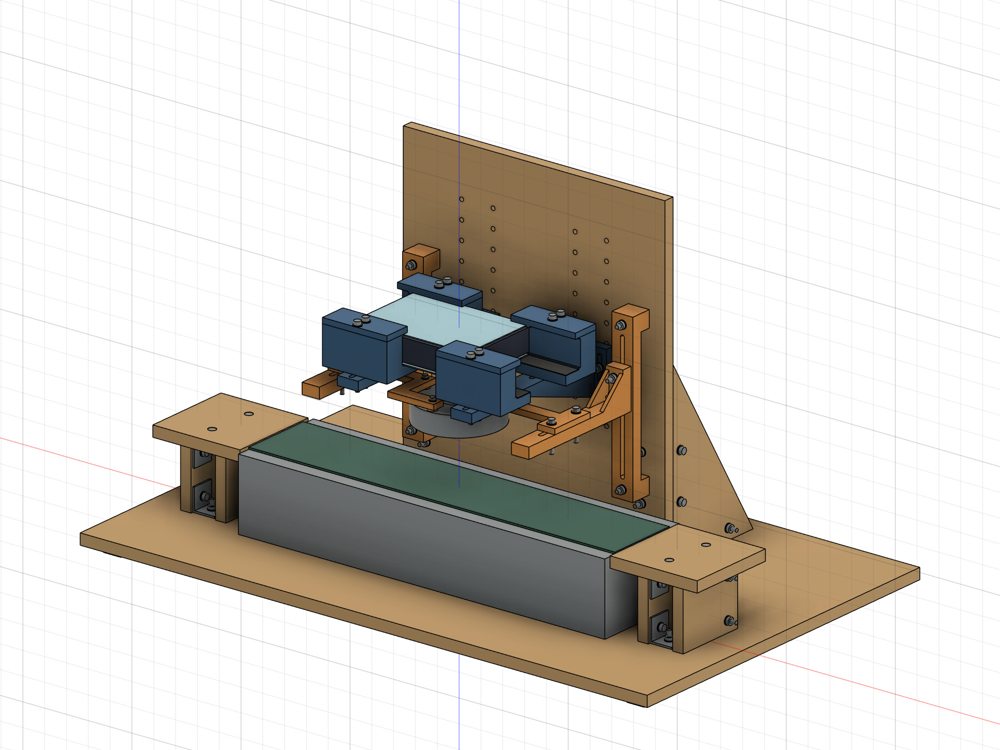
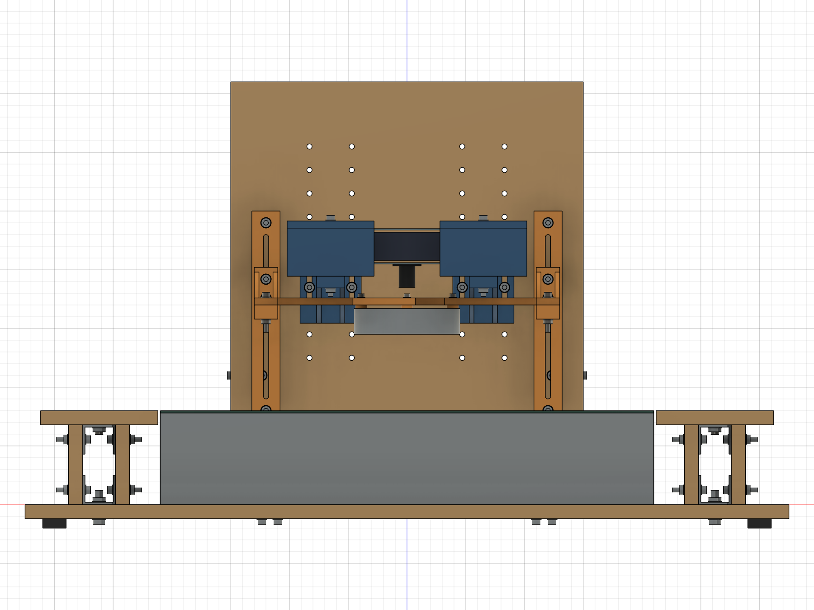
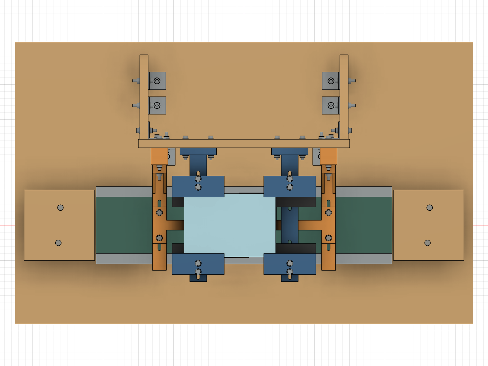
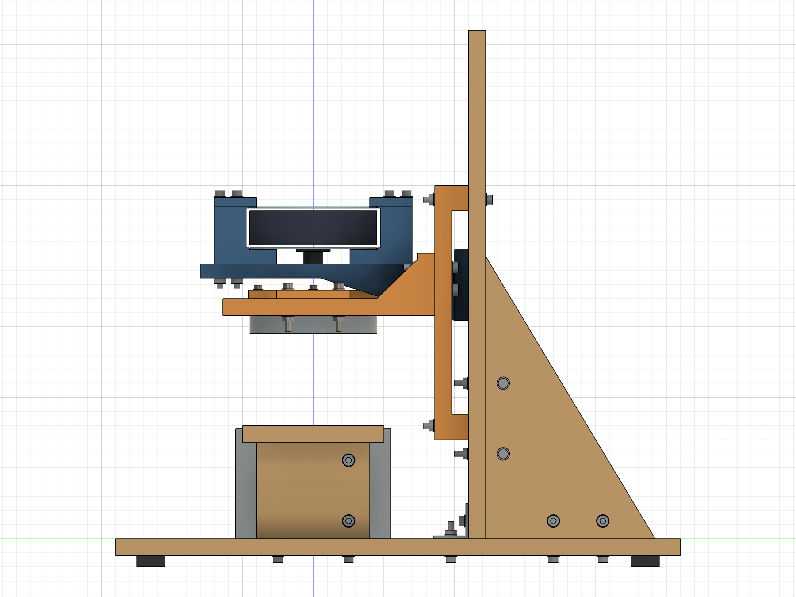
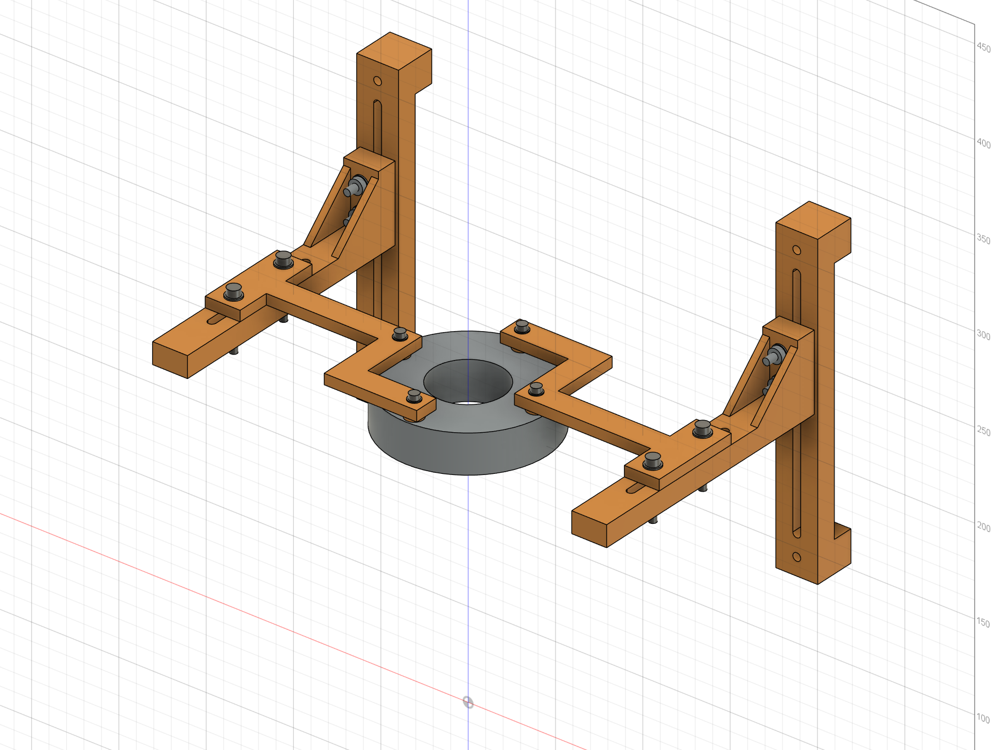
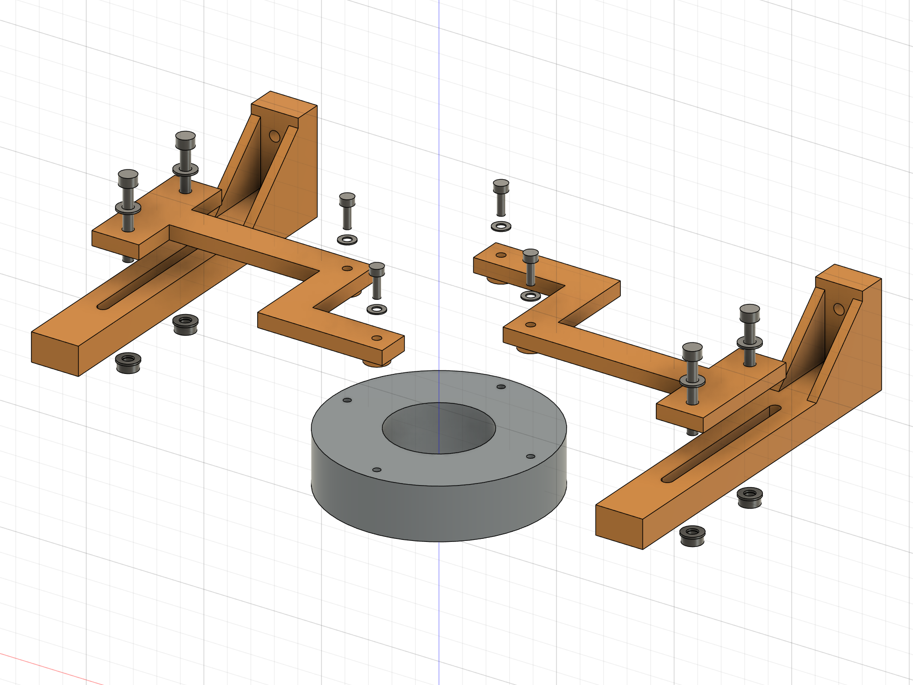

# FPGA 载带视觉检测装置 R2b · 背面四孔灯架

**试制布局评审版｜2026-09-19｜真实 Fusion 参数化实体｜尚未实物验收**

已在 R2a 原生模型上完成修改并另存；R2、R2a 原生文件 SHA-256 校验未变。当前交付用于确认布局，P08 尚未放行打印。取消 HT02 独立试片；暂停旧 P06A/B 试打；CT01／02／03 沿用原计划。本次没有输出新增或修改零件的 STEP、STL、切片任务或制造工程图。

## 1. 查看模型与整体布局

[打开原生参数化装配](FPGA_Inspector_R2b_Parametric.f3d)。Fusion 中已打开该归档的回读副本，可旋转检查。模型保留 71 个用户参数、1458 项历史记录和 304 个活动实体；其中含现有设备、紧固件及未定长 M3 占位包络。P08 采用受约束草图和拉伸、连接、切孔特征，每个实物单独组件实例。

相机两托臂仍在 X=±65，板卡中心 X=−20，镜头偏心 +20，灯心、镜头与检测点在默认 Y=0 时同轴。相机及承托相关 19 个实体与 R2a 对比，体积及世界包络差异均为零。木底板仍为 650×400×12，设备固定孔待实物定位。图中已有木结构连接孔不代表设备安装孔已经确定。

三视图按功能坐标：正视从 −Y 看，俯视从 +Z 看，右视从 +X 看；均为正交投影，不是逐件制造工程图。

## 2. P08 连接板与局部爆炸

爆炸图来自最终 CAD 实体的临时复制，仅为显示分离：灯下移 25，P08 上移 18，M3 垫片上移 29，M3 占位包络上移 43 mm；不改变原生装配。外侧为 P05 与保留的 M4×30 连接，中央为灯背面四孔。M3 图示只包含头部及板内杆段，**没有指定伸入灯壳的杆长，不能根据图中杆长采购螺丝**。

右侧 P08 由以下矩形区域并集，主体厚 6 mm，左侧为同一组件旋转 180°。条宽 14、主体厚 6 均为试制初值，承载、蠕变与温升待首次件验证。

|区域|X 范围 mm|Y 范围 mm|
|---|---:|---:|
|上侧横条|−7～46|32～46|
|竖向连接条|32～46|−7～46|
|外伸横条|32～120|−7～7|
|双孔安装耳，20×52×6|110～130|−26～26|

|接口|实体设计|
|---|---|
|灯安装孔|右件 (39,0)、(0,39)，左件旋转后 (−39,0)、(0,−39)，4×Ø3.6 通孔|
|支脚|每件两处一体 Ø10×3，接触灯背面；孔贯穿主体及支脚|
|P05 连接|每件外侧 2×Ø4.5，X=±120，Y=±18，孔距 36|
|M3 平垫片|暂按 OD7／ID3.6／厚0.5 包络，采购尺寸待核|
|M4 平垫片|沿用 OD9／ID4.5／厚0.8 包络|

### 实体重算与支承面

单件最终 BRep 包络 **137×72×9 mm**，体积 **19441.17 mm³**。该尺寸由最终实体重新读取，虽与早期估算相同，计算依据已更换。单件右侧范围 X=−7～130、Y=−26～46、Z=167～176。

中央 Ø40 圆柱与 P08 的径向避让约 **12.00 mm**，通过 BRep 圆柱相交夹逼计算；数值按 0.01 mm 显示。该距离只说明连接板不侵入中央通光孔，不能证明全部视场或光学效果。默认镜头调焦 Ø34 包络及发光面下方通光区域未检出结构干涉。

|项目|名义实体结果|意义与限制|
|---|---:|---|
|M3 孔壁至 14 mm 条边|5.20 mm|不含未知打印尺寸偏差|
|Ø10 支脚剩余径向壁厚|3.20 mm|支脚接触面实物仍待确认|
|Ø7 垫片至主体外缘|3.50 mm|两处均未跨越主体外缘|
|每处 M3 垫片承托面积|28.306 mm²|以实体薄层交集计算，完整名义环面|
|每处支脚名义环面|68.361 mm²|不能等同实际灯背面承载接触面积|
|M4 孔至安装耳最近端边|5.75 mm|横向孔边余量 7.75 mm|
|M4 垫片至安装耳最近边|3.50 mm|每处上垫片承托 47.713 mm²|
|P05 下垫片承托|最低 24.874 mm²|考虑槽的开口；端位外侧一孔约 31.794 mm²|

Ø10 支脚最外缘距灯壳 Ø90 理论外圆仅 **1 mm**；背面倒角、凸台、凹槽、散热孔或线口可能侵占接触区域，必须依照片或尺寸确认，不能按完整圆盘假定可承载。

### 两件互换状态

两件 P08 共享同一组件定义；第二实例矩阵为绕 Z 轴 180°，没有镜像、非均匀缩放或另改孔位。旋转实体与第二实例的交集体积差为 0；四个 M3 轴及两侧 M4 接口与装配对应。10 个 P08 草图均完全约束。

结论仅为 **CAD 同款候选成立**。首次实物装配须交换两件，只旋转 180°完成安装，不得强拉对孔。若必须分别修形或改变接口才能安装，改为 P08L／P08R 独立编号。当前不能宣称已通过实物互换。

## 3. 高度链与螺丝

以底板上表面为 Z=0。默认检测面 Z=85、拍摄距离 D=100、灯发光面距检测面 H=60；带面 80、样品高 5、板卡总叠层 30、镜头突出量 20 都仍为假设。

|面或实体|关联式|默认 Z mm|
|---|---|---:|
|灯发光面|detect_z + H|145|
|灯背面／支脚底面|lamp_back = lamp_bottom + lamp_h|167|
|支脚顶面／板主体下表面／外安装耳下表面|p08_bottom = lamp_back + p08_foot_h|170|
|P05 上接触面|p08_bottom|170|
|P05 承托板下表面|p08_bottom − 12|158|
|P08 主体及安装耳上表面|p08_top = p08_bottom + p08_t|176|
|M3 平垫片上表面／螺丝头下承压面|p08_top + 0.5|176.5|
|P05 根部两连接孔轴高|p08_bottom + 6／+22|176／192|

P05 相对旧版整体升高 6 mm，实体形状和体积不变；根部紧固件同步变化。其关联已从旧夹圈高度改为 P08 接触面。前后参数 lamp_y 通过一个刚性装配关联驱动两件 P08，保持 180°关系；灯本体和外侧紧固件随同对中。

**M3 长度待定，不下采购结论。** 螺丝头下长度 L，主体 t、支脚 h、平垫片 w：

`实际拧入 e = L − t − h − w = L − 6 − 3 − 0.5 = L − 9.5 mm`

`e_max = L_max − t_min − h_min − w_min`

`e_min = L_min − t_max − h_max − w_max`

须使 e_min 满足厂家必要啮合长度，同时 e_max 留在厂家允许最大拧入范围内并满足规定底部余量。公差取实际采购件、打印件测量和厂家要求；本轮不编造可用深度或紧固扭矩。图示孔深 4 mm 只保留为图纸信息；灯壳孔在 CAD 内是简化螺纹包络，没有模拟真实牙型。

P08/P05 外侧复核后保留 **4×M4×30、4×M4 螺母、8×M4 平垫片**：夹持实体 6+12=18 mm，两垫片 1.6、螺母 3.2，名义露出螺母 30−18−1.6−3.2=**7.2 mm**。默认及检查端点无几何干涉；实购物料须核对螺纹覆盖、垫片厚度、实际螺母与工具包络。无需因此另购四套紧固件。

## 4. 新版有效行程与操作限制

所有长度为 mm。D 为镜头端面至检测面，H 为灯发光面至检测面；Y 正向向后。Y=0 才是既定同轴检测位置，前后行程用于安装对中，不能把偏离 0 的位置称为同轴工作状态。

|机构|槽几何允许位移，已扣必要余量|装配结果|
|---|---|---|
|相机高度短槽|28−4.5−0−2=**21.5**|20 mm 分档交叠 1.5；不是 56 mm 的承托安装槽|
|灯竖槽双螺栓|140−4.5−16−2=**117.5**|按当前高度链，槽自身对应 H=−22.75～94.75；不代表整机可用|
|灯前后槽双螺栓|72−4.5−36−2=**29.5**|Y=−14.75～+14.75；另受手部和组合高度限制|

**供布局确认的保守操作窗口：D=50～200，H=10～92，且 D≥H+40。** 这组窗口是在默认设备包络及名义尺寸下、根据实体扫描和余量选定的使用限制；不是未经余量处理的极限，也不保证能合焦。

- H≥16 时，保留全前后位移 ±14.75。
- 10≤H<16 时，为预留取样空间，使用 **Y≥−13**，后向仍可至 +14.75；默认 Y=0 不受影响。
- D=100 时上述保守组合窗口要求 H≤60。专项临界检查在 Y=0 下 H=67 未检出体积碰撞，H=68 开始碰撞；不能将近碰撞位置作为有制造余量的工作上限。
- H=60 时，前后端位专项扫描在 D=96.5、Y=+14.75 检出碰撞，D=97 未检出；使用 D≥H+40 留出额外余量。
- 灯架上端 H=93.5 为 P05 顶面与上端固定垫片的名义接触边界，H=94 检出碰撞。取 H≤92 后该处名义垂直余量 1.5。原 R2/R2a 灯高范围不沿用。
- H=10、D=50、Y=−14.75 时，P08 侵入预留取样空间；Y=−13 的复查未检出该侵入。H=16、Y=−14.75 的复查也未检出该侵入。

完成 1050 个组合姿态记录（850 初扫、174 细查、26 临界检查）；默认 304 个实体、451 对包络相交候选的精确布尔检查：0 体积干涉、0 布尔失败、0 特征警告。端点工具/操作包络共 216 项，保留上述低灯位前移失败记录并收紧使用窗口。扫描是离散采样和局部解析边界核对，不是完整连续运动、制造公差或承载认证。

## 5. 装入、维护和操作包络

默认姿态下 27 项工具及空间包络未检出干涉：M3 台面工具 Ø8，M4 头部工具 Ø10、螺母扳手空间，P05 根部前后工具，镜头调焦 Ø34，接口与取样预留空间。实际接口朝向、插头及线缆弯曲仍未知，预留包络检查不能代替实物插拔。

**装配顺序修正：** P08 安装耳不能直接从下方穿过 P05；默认 D100/H60 下抬高 5 mm 从前面送入，会碰到相机承托块下方螺栓与螺母。不得按该路径强装。

1. 打印前确认灯背面接触区域和允许拧入深度，确定 M3 长度后，台面装好灯、两件 P08、四个 M3 平垫片及螺丝。
2. 灯架保持 H60、Y0，先把相机升高一档至 **D120**，确认线缆有余量。四个 P08/P05 外侧 M4 暂不装入。
3. 灯组件较落座位置抬高 5 mm，自前方 Y 偏移 −160 向 0 送入，再竖向下降 5 mm，使外耳落在 P05 上。
4. 安装外侧 M4 螺栓、上下垫片和螺母，对中后锁紧；恢复相机 D100，检查线缆和焦距。
5. 维护 M3 时反向拆出灯组件，在台面操作，不要求在板卡下方直接拆 M3。

D120/H60 维护姿态的装入路径已按前后 1 mm、下降 1 mm 采样，共 166 个位置，无体积干涉；相应 27 项工具/空间包络无干涉。结论只覆盖此明确维护姿态，其他高度先调回该姿态，线缆走向和手持过程仍需实物试装。

## 6. 新旧零件与紧固件增删

|项目|R2b 处理|数量影响|
|---|---|---|
|P06A、P06B 外夹圈|从新版活动装配移除，旧版保留|各 −1|
|S03A、S03B 软衬|移除|各 −1|
|旧 P07L、P07R|由 P08 替代|各 −1|
|P08 背孔连接板|新增共享定义的同款候选件|+2|
|P04|沿用|2 件不变|
|P05|实体不变，修改高度参数关联|2 件不变|
|旧连接板至灯圈 M4×35|取消|−4 螺栓、−4 螺母、−8 垫片|
|旧夹圈夹紧 M4×35|取消|−2 螺栓、−2 螺母、−4 垫片|
|外侧 P08/P05 M4×30 组|重新建模复核，实物沿用|4 螺栓、4 螺母、8 垫片不增加|
|灯背面 M3 螺丝|新增，长度待定|+4|
|M3 平垫片|新增，尺寸待采购核实|+4|
|HT02|取消，不建模、不切片、不交付|0|
|CT01／02／03|承托小样原计划不变|无本轮改动|

旧夹圈相关用户参数保留在历史中供追溯；没有活动 P06、P07、S03 或旧夹圈紧固件实例，不计入新版用料。旧文件未覆盖。

## 7. 打印门槛与首次装配记录

**打印前必确认：** 灯背面四孔周边可承载平面、Ø10 支脚落点、背面高低差／倒角、线口与电缆弯曲空间、散热开口；厂家最大允许拧入深度、必要啮合长度及底部余量。待信息确认后再决定是否调整支脚或板形，以及最终螺丝长度。3 mm 架空不等于温升合格。

**取消独立 M3 试片。** P08 的 Ø3.6 通孔是未验证试制选择；HT01 仅验证 M4，不用于 M3 结论。M3 试穿合并至 P08 正式件首次装配；若必要，只对打印通孔手动轻修并记录，**不得扩大灯壳螺纹孔**。

首次件仍须检查：两件 180°互换、孔径及修整、四脚贴合与晃动、螺丝实际拧入、垫片支承、受载挠曲、长期松动/蠕变、工作温升、线口、光路遮挡和实拍焦距。未试验的项目均为待验证。没有新建 HT02 或增加单独试片费用。

## 8. 证据与文件说明

原生归档重新导入后：304 个活动实体、71 用户参数、1458 历史项；两件 P08 同组件 ID、10 个草图均完全约束、无特征警告。参数 lamp_y=10、灯高=65、P08厚=7 的临时修改与恢复均完成重算健康检查；其中 Occurrence 包络读取返回零值，已弃用，不能作为尺寸证据。本报告实体尺寸使用直接 BRep 精确包络及归档回读结果。

完整记录位于 evidence：P08_native_checks、interface_checks、geometry_check、pose_sweep、pose_refinement、critical_boundaries、access_checks、service_access_checks、range_access_checks、camera_unchanged、archive_readback、old_versions_preserved。包含失败姿态，未删除不利结果。脚本在 scripts 供追溯；几何检查不代替实物、承载或光学验收。
