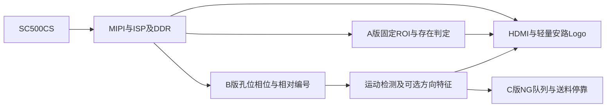

# 国产FPGA载带元件智检仪 项目总体分析与开发基线

> 修订日期：2026-09-07。已按用户批准的十项意见修订计划；功能、参数和性能仍须实测验收。
> 平台：HX1P35A / PH1P35MDG324 / SC500CS MIPI / HDMI。
> 执行入口：`开发实施/00_分阶段开发与逐级验证路线.md`；填写材料见同目录Word及验收模板。

## 1. 项目目标和版本边界

项目面向载带中元件的可见外观检查。先做固定机位下的存在/空穴识别，再验证连续运动和相对编号，最后实现NG停车、人工处置和复检。OK表示通过本版本启用的检测项目，不能解释为元件全部质量合格。

| 版本 | 必须实现 | 不作为本版前提 |
|---|---|---|
| A 视频识别版 | 真实载带固定检测区；存在/空穴识别；至少一种处理后视图；稳定HDMI；安路Logo及结果文字；同一镜像固化冷启动 | 电机、连续编号、极性识别、多穴位、FIFO、多帧和双光场 |
| B 连续检测版 | 一种锁定料号和载带；实测可用的低速送料；本次运行相对编号；失锁暂停和重同步；运动存在/空穴识别；实际采用的运动叠加正确 | 永久整卷绝对序号、自动返修、复杂补偿；方向检测在特征通过验证后增加 |
| C 停车闭环版 | B版基础；实测停车预算；NG队列；正确穴位停靠；人工处置；复检后继续；异常和满队列处理 | 卷对卷全自动保持/封合、自动取放、双光场、第二配方 |

单穴、双穴或多穴方案均可，以实际有效视场和特征像素数确定。版本A/B/C是交付阶段，与团队A/B/C组的人员分工不同。

## 2. 赛题对应与完成证据

依据本地2026-09-05版《赛题解析二》PPT第5、6、26页：基础至少3条、扩展至少1条；本项目计划在A版完整覆盖4条基础和目标检测识别扩展。计划批准不代表功能完成。

| 赛题要求 | 本项目实现安排 | 必须保存的证据 |
|---|---|---|
| MIPI采集和HDMI实时显示 | A版以官方Lab 1为底座 | 工程版本、实物视频、输入/输出模式与帧率 |
| FPGA图像处理并输出处理后视频 | A版保留灰度或二值视图，边缘可选 | 同一镜像切换或展示处理画面；确认FPGA执行处理 |
| 处理画面连续稳定 | 各版本独立验证 | 连续运行录像、帧/错误计数、异常记录 |
| 图形或文字OSD及安路Logo | A版保留小尺寸可辨认Logo和结果文字 | 同屏截图与整合镜像 |
| 目标检测识别并叠加说明 | A版识别真实元件存在/空穴 | 独立物理样本、真值表、逐样本结果 |
| 实际场景外部控制 | C版由实时NG触发停靠 | 对应缺陷穴位和控制动作的视频 |
| 性能优化 | 所有版本记录；有可比基线时说明优化 | 同功能、同模式的资源、时序、延迟和功耗对比 |
| 自主创意 | B/C的相对编号和处置流程 | 实际完成的演示与边界说明 |

开发板须为HX1P35A；最终设计须固化，上电运行无需PC再次下载；已实现功能须整合于同一最终设计，不能依靠重新加载不同镜像分别演示。目录中HX1P35B命名的参考资料不等于实物板卡型号，必须核对丝印与引脚。

缺Logo不能算完成基础第4条；即使其余3条可能满足最低条数，本项目也不得以资源优化为由删除Logo。核心检测无PC依赖为团队明确的设计边界。外设扩展以已核对的赛事约束为准，不把无来源限制写成赛事原文。

## 3. 当前第一优先级 真实视场

SC500CS手册第2页给出1.12 μm像素；2592×1944有效像素对应约2.903×2.177 mm。镜头商品参数中的1/2.5英寸适配像面、水平20°视角，不能直接等同于SC500CS上的视角。

原“16 mm镜头、80 mm距离得到28×18 mm视场”的估算撤出工程基线。以薄透镜、物距从主平面量起的假设，一阶估算80 mm处约11.6×8.7 mm；这只是提示存在差异，不是镜头实测值。真实工作距离定义、主平面、裁剪和调焦均会影响结果。

### 3.1 测量办法

1. 用可重复锁紧的支架固定摄像头、镜头和单一顶光，载带沿水平短导轨摆放。
2. 将毫米尺放在元件同一高度平面，记录距离从哪里量到哪里；可在80、110、170 mm附近试验，能合焦就记录，不把这些试验点当最终安装要求。
3. 最终相机模式下记录水平/垂直视场、完整穴位数量、定位孔可见性、极性标记像素数和照片编号。
4. 检查中心及边缘、相机倾角、载带轻微横移；重新装夹后重复拍摄，确认阈值和位置是否仍可复用。
5. 先确认误差是否影响任务，再决定是否需要完整标定和畸变补偿算法。A版可限定固定检测区。

| 待确定参数 | 状态 |
|---|---|
| 镜头焦距、可合焦距离、实际有效视场 | 待实拍 |
| 完整可见穴位数、检测ROI位置 | 待实拍，不预设数量 |
| 检测点至处置点距离 | C版按制动与判定预算确定，不预设相隔孔数 |
| 同相机复检是否可行 | 待视场、操作空间和停车试验 |

## 4. 相机和FPGA工程基线

已核查官方Lab 1相机输出寄存器、ISP及HDMI参数为1024×600，以此作为首先复现的起点，输入帧率上板实测。

SC500CS手册第15页列出2592×1944@30、1920×1080@30和1280×720@60。FHD为Crop，HD为2×2 Binning and Crop；这是传感器能力，不能作为现成可运行的FPGA工程，也不能假设各模式视场相同。

改变模式时，联动验证寄存器、MIPI/RAW解包、ISP尺寸、行缓存、DDR、HDMI时序、时钟和带宽。先保留官方底层，不为追求分辨率过早重写MIPI、DDR和HDMI。

## 5. 样品和缺陷真值

A版先锁定一种真实元件和对应载带，验证正常/空穴。可同时低成本观察正反特征，但极性实验失败不阻塞已能完成的存在/空穴版本。B版需要定位孔节距P0、穴位节距P1和初始相位；禁止默认一孔一穴。

方向检测只适用于顶部可重复观察的标记。偏位和旋转阈值应来自具体元件、穴位及工序允许范围；元件在穴位中的正常活动不能自动判NG。二阶矩主轴不直接提供0°/180°极性区分，近对称外形的角度要另验稳定性。

| 类别 | 制作及确认真值 | 启用阶段 |
|---|---|---|
| 正常 | 正确料号、方向、平放且在允许范围内 | A |
| 空穴 | 从已登记穴位取出元件，确认没有遮挡物 | A |
| 反向 | 同一料号转180°，以可见标记和资料确认 | B按需 |
| 偏位 | 记录相对实际穴位的位移及测量方法，区分正常间隙和越界 | 按需扩展 |
| 旋转 | 记录实际角度、允许角度及真值测量方法 | 按需扩展 |
| 多料或侧立 | 仅在真实形态可复现且图像可区分时启用 | 按需扩展 |

每个物理测试穴位建立真值记录，标记放在检测ROI和定位孔之外，或使用背面/照片对照；不让标签成为分类特征。调参集与验收集按物理样本、测试段或批次划分，同一件的连续帧不当作独立样本。真值编号与运行编号用映射表关联，两者用途不同。

## 6. 分阶段检测与接口

### 6.1 A版编码前必须确认

每拍像素数、像素顺序、位宽、源时钟、`valid/sof/eol`语义、`ready`是否可回压、坐标更新、复位后有效帧和ROI结束时刻。官方96位RGB接口的四组24位像素不能直接当作单像素流。详见`开发实施/04_FPGA接口与异常处理约定.md`。

A版可用固定ROI、静止样品和画面稳定后判定；样品更换时显示等待有效判定，避免旧结果冒充当前结果。若已经实现动态框，必须在该版本验证框和显示图像对应。

### 6.2 B版增加

动态ROI必须在对应像素到达前可用，选择“扫描先得到孔位并缓存必要行”“上一帧位姿加运动预测”或“缓存ROI后处理”，记录方案及误差。不能只画模块连线而不解释时间关系。

动态结果绑定采集帧号，显示快照与DDR读出帧对应。运动事件保留采样时刻/位置，不能用延迟显示帧当实时停车位置。CDC正确与帧匹配正确需分别验证。

## 7. 相对编号和失锁规则

定位孔可以在一次正常连续运行中维持相对穴位编号，如“本次运行第127穴”。它没有自带整卷永久绝对地址，本项目不以永久追溯为B/C版前提。

| 状态 | 行为 |
|---|---|
| 未同步 | 建立起点、方向及P0/P1相位；不输出可信运行编号 |
| 跟踪中 | 每个物理穴位只正式计数一次；视觉和运动预测按接口约定检查一致性 |
| 暂停且仍可信 | 控制停止且位移历史可确认时保留编号，恢复前复核 |
| 失锁 | 超过观测/位移容许界限、滑移或手动拖动使编号不可信时暂停送料，冻结相关结果和队列 |
| 重同步 | 操作者确认受影响带段和旧NG处置，建立新运行段标识及起点后重新编号 |

短暂丢帧不必无条件丢弃编号，但容许时长和位移误差必须经试验明确。失锁不归类为普通元件NG，单独统计；不能默默清空旧队列后放行。独立传感器/编码器是否需要取决于观测可靠性，不预设为A版硬件。

## 8. 运动成像与多帧验证

A版先单帧。B版试验清晰度、模糊、逐行曝光形变及可用帧数；不提前要求实现滚动快门补偿。可通过固定单光源、缩短曝光、降低速度或限定ROI达到任务所需效果。

可用帧数近似 `N = 实测输入帧率 × 有效检测行程 / 实测速度`。有效行程需扣掉不完整、模糊、反光及超过判定截止位置的区域。

`60 fps × 4 mm ÷ 40 mm/s = 6`只表示前进一个节距期间的采样帧数，不保证同一穴位可用6帧。多帧仅在单帧不足且时间窗口允许时加入；选择该功能后再将其等待时间纳入本版预算。

多帧融合按同一运行段、同一穴位对齐，明确最大等待帧数和超时动作。双光场仅属可选扩展，实施时才核对曝光窗口、光源切换相位和相机帧号，不能简单用显示VSYNC替代曝光同步。

## 9. 机械与电气联调

B版先使用水平短导轨、可重复相机支架、保持元件的结构和可控送料。先测试机械再逐级提速，不等待四类静态检测全部完成才试运动。小型传送带商品标题不证明支持STEP/DIR或满足定位，需要核验电机类型、驱动接口、电平及实际位移。

开放穴位在转弯、卷绕和启停时可能改变元件状态。卷对卷方案仅在明确入口保持、出口封盖或其他保持结构后再加入；不能默认装料但未封盖的载带可直接放卷和收卷。项目不承担元件电参数或内部缺陷检测。

首次连接电机驱动和可切换光源时，就对比“电机关闭、匀速、反复启停、灯光开关”下的视频及错误计数，记录MIPI/HDMI闪屏、丢帧、相机或FPGA重启。核查电源纹波、供电容量、回流路径、信号电平和接线；有问题先隔离定位，不通过放宽视觉阈值掩盖。

## 10. C版停车与多NG处置

检测点到处置点距离按实测有效视场和制动能力确定，不预设相隔3～4穴位。

以首次有效采样位置为起点，距离需覆盖：`速度 × 最大判定及控制时间 + 最坏停止距离 + 位置误差余量`。停止距离应在真实负载、速度和电源条件下测试；恒减速度模型只作估算。测量误差、滑移和额外帧等待分别记录。

同相机复检是优先尝试的C版方案，不提前保证成立。若场地或制动距离不允许，先调整速度、工作距离或处置位置；不能在画面看不见目标时声称完成同相机复检。

### 10.1 第一版FIFO规则

1. 以运行段标识和相对穴位号为事件键，同一穴位最终NG只入队一次；复核和复检不重复入队。
2. 按物理送料顺序逐个停靠处置，先不做自动合并处置；前一个未完成时保留后续事件。
3. 队首只有在复检通过或人工明确隔离该带段并记录原因后才能完成，不能按下继续就删除NG。
4. 预留减速期间新NG容量。高水位触发受控停车；储备量覆盖最大判定在途量和停止期间可能新增的穴位数。
5. 队列满或溢出属于系统故障：停止送料，保持可保存记录，显示受影响范围需人工核对，不得静默丢弃并继续生产。
6. 失锁后冻结旧队列；重新建立运行基准前确认未决NG，不把旧编号用于新运行段。

验收单NG、相邻NG、间隔NG、全部NG、高水位停车、队列满、停车中失锁、复检失败及恢复。以实物真值核对停靠穴位，不只看屏幕编号。

## 11. 验收指标与实现质量

所有目标先填写、再测试；未确定的阈值保留待测，不用“识别率95%”统一代替各类错误。

| 指标 | 记录方法 | 阶段 |
|---|---|---|
| 正常误报 | 正常件被判NG数 / 正常件数 | A起 |
| 异常漏检 | 已启用类别中被放行的异常数 / 该类异常数 | A起 |
| 正常件误停 | 因正常件误报触发的停车次数；同时记录每百正常穴 | C |
| 停错穴 | 停到错误物理穴位的次数 / 定位停车次数 | C |
| 丢号/重号、失锁及重同步 | 分开记录次数、触发原因、受影响运行段 | B起 |
| 净吞吐 | 完成检测/处置的唯一物理穴位数 / 总运行分钟；含停车、人工处理和恢复，复检不重复计产量 | B/C |
| 延迟 | 分开测像素流水、采样到判定、采集到显示；可变复核报告最大值和超时 | 各版本按功能 |
| 时序与资源 | 每加模块保存LUT、Slice、FF、ERAM、DSP及布局布线时序，核对建立/保持和约束覆盖 | A起每次集成 |
| 干扰与稳定性 | 视频错误计数、重启/闪屏、运行时间、开关工况 | A视频；B首次电机联调 |
| 固化冷启动 | 同一镜像和配方，断电再上电不重新下载，录像并记录 | A起每版复测 |

仅评估正在启用的功能。建议A版每类先收集至少30个独立物理样本作为调试起点；最终样本量和错误目标按实测能力与声明范围确定，不以少量零失败样本宣称工业精度。B/C先短段验证，再扩展至500～1000穴运行试验；反复使用同一带段须注明。

## 12. 风险所属阶段

| 检查项 | A版必做 | B版验证 | C版验证 | 可选扩展 |
|---|---|---|---|---|
| 视场、支架、固定ROI与正常/空穴真值 | 是 | 检查运动与横移 | 检查处置可达性 | 完整畸变补偿按需 |
| 接口、资源、时序、Logo、冷启动 | 是 | 每次集成复测 | 每次集成复测 | 扩展也复测 |
| 滚动快门与多帧 | 静态识别不要求补偿或融合 | 先测是否影响，再选简化措施 | 计入判定时间 | 复杂补偿按需 |
| 动态框与DDR帧匹配 | 未做动态框则用固定区；若已做动态框必须验证 | 实施跟踪叠加时必须验证 | 与控制事件时间区分 | — |
| 电机干扰、相对编号、失锁 | 无电机/无编号时不适用 | 首次启用即验证 | 复核停车恢复 | 独立位移传感器按需 |
| FIFO、停车距离、复检 | 不要求 | 可提前试机构 | 是 | 合并处置按需 |
| 双光场、第二配方、缺陷地图 | 不要求 | 不要求 | 不要求 | 具备基础证据后增加 |

## 13. 本轮修订与当前动作

十项授权意见已经落实到本文件和开发文件。下一步从官方视频基线与毫米尺实拍开始；不再以固定孔数、固定停车间距或全部四类检测作为A版立项条件。

说明性介绍须按已验收版本写：A版只描述静态存在/空穴识别，B版再描述连续相对编号，C版通过后才描述停车复检。功能待做与完成证据在验收记录中区分。

参考：本地《赛题解析二》PPT（2026-09-05，第5、6、26页）；SC500CS数据手册V1.8（第2、15、21页）；官方Lab 1；`开发实施/02_FPGA资源预算与代码优化规范.md`。初次评审的计算与背景见同目录《第一性原理评审与赛题符合性_20260907.md》，历史问题须结合其修订状态阅读。
