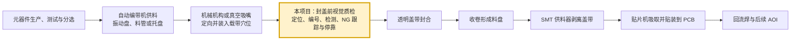
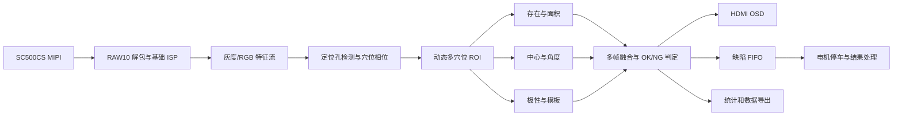

# 国产FPGA载带元件智检仪——项目总体分析与开发基线

> 正式名称：国产FPGA载带元件智检仪  
> 目标平台：安路 HX1P35A / PH1P35 FPGA / SC500CS MIPI 摄像头  
> 当前定位：电子元件装入载带后、透明盖带封合前的在线视觉检测与返修工位  
> 文档用途：方案评审、软硬件分工、接口对接、样机开发和比赛答辩的统一依据  
> 更新时间：2026-08-27

具体实施顺序与阶段验收方法见：`开发实施/00_分阶段开发与逐级验证路线.md`。

---

## 1. 项目结论

本项目检测的不是散装元件，也不是人工一次放入一颗元件，而是检测一整条连续载带。

一条载带上按固定节距排列着大量元件穴位，每个正常穴位中放置一个 SMD 元件，载带侧边带有规则定位孔。系统让载带连续经过摄像头，FPGA 对穴位逐个编号、逐个检测，并对不良穴位持续跟踪。

推荐的真实工作阶段为：

> **元件已经装入穴位，但透明盖带尚未封合。**

### 1.1 本项目在实际工程流程中的位置

工业生产中，元件通常由自动或半自动编带设备完成供料、定向和入穴。本项目不负责制造元件，也不代替上游装料机构；它作为独立视觉检测工位，安装在“元件装入载带”与“透明盖带封合”之间。

工程边界可以概括为：

> **工业上元件主要由自动编带机装进载带；本项目负责装料之后、封盖之前的视觉质检。它能服务 SMT 上料质量保障，但不是贴片机，也不是完整的 SMT 检测系统。**

检测合格的载带在下游完成盖带封合与收卷，随后才作为 SMT 贴片机的供料来源。若以后扩展到已经封合的载带，需要另外解决透明盖带反光、表面划痕和极性特征遮挡等问题，不能直接等同于当前开放载带方案。

选择这一阶段的原因：

- 没有透明盖带反光，元件轮廓和极性标记更容易成像；
- 发现空穴、反向或偏位后，异常穴位仍处于可处理状态；
- 处置后可根据最终机械方案选择是否使用同一摄像头复检；
- 确认合格后再压合透明盖带并收卷，符合实际编带工艺顺序；
- 避免“已经封装却又逐穴揭带返修”的工程矛盾。

项目形成的完整闭环为：

> **连续送料 → 定位孔同步 → 逐穴检测 → 缺陷地址化 → 精准停车 → 结果处理 → 确认后继续封带/收卷。**

---

## 2. 作品名称与简介

### 2.1 作品名称

简称：

> **载带元件智检仪**

正式申报名称：

> **国产FPGA载带元件智检仪**

### 2.2 推荐作品简介

面向极性 SMD 元件载带封装过程中、覆膜封合前的质量检测需求，本系统基于国产 PH1P35 FPGA 和 SC500CS MIPI 摄像头，对连续输送的载带进行低延迟在线检测。

系统以载带定位孔为基准，完成穴位定位、连续编号和运动同步，实时识别空穴、元件偏移、姿态旋转、极性反向及多料等异常，并在 HDMI 画面中标注检测结果、缺陷类型和穴位编号。系统采用 OK/NG 两级最终质量判定，并通过多帧融合提高临界情况下的判定可靠性。

对于确认 NG 的穴位，系统记录其编号和缺陷信息，结合定位孔计数与送料运动信息持续跟踪其位置，控制送料机构将其精准停至异常处置位置。系统支持检测参数配方切换、连续缺陷队列管理和整卷质量统计，可适配多种具有可见方向或极性特征的 SMD 元件，形成“实时检测—缺陷定位—精准停靠—结果处理”的完整工作流程。

### 2.3 与赛题基础要求的逐项对接

赛题基础要求共 4 条，最终设计至少实现 3 条。本项目不只满足 3 条，稳定版应将 4 条全部集成到同一固化镜像中。

| 赛题基础要求 | 本项目对应实现 | 现场验收证据 | 版本定位 |
|---|---|---|---|
| MIPI 摄像头采集并通过 HDMI 实时显示 | SC500CS RAW10 经 MIPI D-PHY/CSI 解包、基础 ISP、DDR2 缓存后送入 HDMI | 屏幕连续显示运动载带和真实元件 | 稳定版必做 |
| FPGA 端至少完成一种图像处理算法 | 灰度/二值化、3×3 滤波、边缘或梯度、形态学、行列投影、矩计算和模板差分 | 按键切换“原图/二值/边缘/检测叠加”调试视图 | 稳定版必做 |
| 处理后视频稳定输出，画面连续无明显异常 | 视频处理、检测框和统计信息随载带连续更新，不闪屏、不撕裂、不丢帧 | 连续运行录像、帧率计数和长时间稳定性测试 | 稳定版必做 |
| OSD 叠加简单图形或文字，并包含“安路”Logo | 叠加安路 Logo、穴位编号、检测框、缺陷类别、统计、速度和处理延迟 | HDMI 主界面直接展示 | 稳定版必做 |

基础要求不是单独演示四个互不相关的实验，而是嵌入载带智检仪的完整工作流程：

`MIPI 采集 → ISP/图像处理 → 元件检测 → OSD 结果叠加 → DDR2/HDMI 稳定显示`

### 2.4 与赛题扩展要求的逐项对接

赛题扩展要求至少实现 1 条。本项目的主功能直接覆盖目标检测、实际场景联动、性能优化和自主创新，视觉增强作为图像前端和调试视图实现。

| 赛题扩展要求 | 本项目对应功能 | 评委可见结果 | 版本定位 |
|---|---|---|---|
| 视频风格化或视觉增强 | 固定曝光、灰度/颜色特征、边缘增强、二值化、顶光/背光图像增强 | 原图、边缘、二值和检测结果可平稳切换 | 稳定版具备，双光场为冲刺 |
| 目标检测与识别 | 识别穴位、定位孔和元件，分类空穴、偏位、旋转及极性反向 | 检测框、类别、坐标、角度和置信度叠加 | 核心扩展，稳定版必做 |
| 面向实际场景并根据识别结果控制外设 | 根据 NG 穴位编号控制步进送料、精准停车、状态灯和蜂鸣器，返修后复检 | NG 倒计数、自动停车、人工修正、复检变绿 | 核心扩展，稳定版必做 |
| 提高实时性并降低资源占用 | 像素流流水线、动态 ROI、行缓存、小模板、共享定点运算和缺陷 FIFO | 帧率、吞吐率、延迟、资源和功耗报告 | 稳定版测量，冲刺版优化 |
| 自主创意 | 基于定位孔的缺陷地址化、多穴位跟踪、同相机返修复检、整卷缺陷地图和工艺漂移预警 | 从“发现 NG”延伸到“定位、处理、复检和追溯” | 稳定版形成闭环，冲刺版深化 |

答辩时应明确：本项目不是为了凑扩展条目而附加电机，而是图像判定结果直接决定送料机构何时停车、哪个穴位需要返修以及复检后是否恢复生产。

### 2.5 与进阶建议的对接

赛题解析还给出了若干进阶方向。它们不是稳定版全部必做，但可以用于安排冲刺优先级。

| 进阶建议 | 本项目对接方式 | 优先级 |
|---|---|---:|
| 多算法切换与状态显示 | 原图、灰度、二值、边缘和检测叠加视图；屏幕显示当前视图和产品配方 | A |
| 目标跟踪与信息标注 | 对画面内 5～7 个穴位持续跟踪，叠加编号、状态、坐标和缺陷类型 | A |
| 处理延迟可视化 | 统计像素/帧计数，显示从检测线到判定输出的固定延迟 | A |
| 运动目标检测 | 不做泛化帧差演示，改为基于定位孔的载带运动相位、速度和跑偏检测 | B |
| 图像质量自动调节 | 稳定版固定曝光；冲刺版根据清晰度和亮度质量分数提示调光或自动降速 | B |

### 2.6 最终提交必须遵守的赛题约束

- 必须使用 HX1P35A 开发板和安路 PH1P35 FPGA；
- 最终功能固化在开发板上，上电即可运行；
- 核心检测和机电联动不依赖 PC；
- 基础、扩展和冲刺功能必须整合在同一最终设计中，不能靠多次下载不同固化镜像分别演示；
- 自制扩展板只能承担电机驱动、光源驱动、电平转换、传感器和接口功能，不得加入非安路 FPGA；
- 性能评价不能只比资源使用量，应同时给出实时性、稳定性、逻辑优化和功耗；
- 所有扩展都必须服务于真实载带检测场景，不能变成与主项目无关的功能拼盘。

---

## 3. 检测对象与项目边界

### 3.1 第一种主样品

第一版只锁定一种元件，推荐优先顺序为：

1. 顶部具有明显缺角、色点或内部非对称结构的 3528/5050 SMD LED；
2. 具有明显阴极色带的 SOD-123 贴片二极管；
3. 具有明显极性条的较大封装钽电容。

若候选 LED 的顶部极性特征无法稳定成像，应更换 LED 型号，而不是依赖复杂算法硬猜极性。SOD-123 二极管可作为更稳定的第二演示配方。

### 3.2 稳定版必须检测

- 空穴；
- 元件中心偏位；
- 元件旋转角度或明显姿态异常；
- 一种具有可靠可见特征的极性反向；
- 定位孔漏检、堵塞或明显破损；
- 穴位编号、NG 记录与返修定位。

### 3.3 可扩展检测对象

| 元件类型 | 可检测内容 | 适合程度 |
|---|---|---:|
| SMD LED | 空穴、偏位、方向、颜色和明显外观异常 | 主样品 |
| SOD-123/SOD-323 二极管 | 阴极色带、方向、偏位、错件 | 很适合 |
| 钽电容 | 极性条、方向、尺寸、偏位 | 很适合 |
| SOT-23 | 空穴、位置、角度、封装方向和明显错件 | 适合 |
| SOP/SOIC | Pin 1 缺口或圆点、方向、明显引脚异常 | 适合但要求更高 |
| QFN/DFN | Pin 1 标记、缺角、方向和外形 | 后期扩展 |
| 电阻、电容、电感 | 空穴、偏位、侧立、错尺寸和明显破损 | 只能做外观，不测电参数 |

### 3.4 第一版不承诺

- 任意型号无需标定即可识别；
- 0201、0402 等超小元件的精细缺陷；
- MLCC 电容量、电阻阻值或 IC 功能；
- 芯片内部缺陷；
- 微米级引脚共面度；
- 透明盖带下的所有微小划痕；
- 依靠单张普通图像可靠判断不可见的底部极性标记；
- 工业设备每小时数万颗以上的速度。

---

## 4. 一条载带是怎样进入系统的

载带不是一颗一颗人工送入。操作人员将整条装有大量元件的载带安装到设备中，系统自动连续送料。

比赛演示不需要准备几千个穴位，可制作 50～100 个穴位的真实测试段，其中包含正常件和可重复的预制缺陷。

### 4.1 从左到右的机械流程

1. **放料卷盘**：放出已经装入元件、尚未封盖的载带；
2. **入口导向与轻张紧**：限制左右摆动，避免载带松弛；
3. **齿孔送料轮**：步进电机通过送料齿与定位孔啮合，作为位置主轴；
4. **检测与返修共视场工位**：摄像头一次观察约 5～7 个穴位；
5. **返修操作窗口**：NG 穴位到位后允许操作者从侧面使用镊子处理；
6. **可选盖带压合机构**：稳定版可预留，冲刺版加入压敏盖带和压轮；
7. **收料卷盘**：以低张力跟随收卷，不作为精确位置主轴。

### 4.2 检测通道为什么要避空

载带穴位通常向下凸出。检测轨道只能支撑载带两侧平面区域，中间必须留槽，否则穴位会刮擦平台并产生抖动。

若使用底部背光，避空槽下方安装透光窗口和漫射板。

### 4.3 检测区与返修区

16 mm 镜头的目标水平视场约 28～35 mm。若穴位节距为 4 mm，画面可同时覆盖约 5～7 个穴位。

建议在同一画面内设置两个固定区域：

- **检测区**：位于画面中部偏上游，穴位经过时完成正式判定；
- **返修区**：位于画面下游，与检测区相隔约 3～4 个穴位。

同一摄像头同时看见检测区和返修区，因此返修完成后可直接对返修区 ROI 复检，不需要第二台摄像头，也不需要把载带倒回去。

---

## 5. 相机、镜头、视场和照明

### 5.1 SC500CS 可用模式

SC500CS 数据手册给出的主要输出模式为：

- 2592 × 1944 @ 30 fps；
- 1920 × 1080 @ 30 fps；
- 1280 × 720 @ 60 fps；
- RAW8/RAW10、1/2 Lane MIPI。

建议：

- 静态和精度验证优先使用高分辨率 30 fps；
- 连续高速演示可评估 1280 × 720 @ 60 fps；
- 最终必须以赛事基础工程实际支持的寄存器配置和时序为准。

### 5.2 已选镜头方案

当前推荐购买参数：

- 焦距：16 mm；
- 接口：M12 × 0.5；
- 像面：1/2.5 英寸；
- 分辨率：5 MP；
- 最近摄距：约 80 mm；
- 水平视场角：约 20°；
- 垂直视场角：约 13°；
- 畸变：不高于约 1%；
- 光圈：约 F1.8。

在约 80 mm 工作距离下，理论视场约为 28 mm × 18 mm，适合完整覆盖 8 mm 或 12 mm 载带、定位孔以及约 5～7 个 4 mm 节距穴位。

理论像素密度参考：

| 模式 | 28 mm 水平视场下的像素密度 | 3.5 mm 元件理论宽度 |
|---|---:|---:|
| 2592 像素宽 | 约 92.6 px/mm | 约 324 px |
| 1920 像素宽 | 约 68.6 px/mm | 约 240 px |
| 1280 像素宽 | 约 45.7 px/mm | 约 160 px |

以上仅为几何估算，最终清晰度还取决于镜头 MTF、实际工作距离、调焦、传感器裁剪和照明。

### 5.3 画面看到多个穴位，但逐穴判定

“画面中看到 5～7 个穴位”不等于“一次批量输出 5～7 个结果”。推荐逻辑为：

1. FPGA 同时跟踪画面内所有可见穴位；
2. 穴位进入画面后先显示为待检测；
3. 穴位中心经过固定检测线时生成一次正式结果；
4. 同一穴位经过检测区期间可获得多帧图像；
5. 使用最清晰帧或多帧投票形成最终判定；
6. 判定完成后锁定结果，避免重复计数。

### 5.4 照明方案

稳定版至少完成顶部漫射光，冲刺版增加 FPGA 同步双光场：

- **顶部漫射光**：观察元件表面、极性标记、缺角和内部结构；
- **底部背光**：提取定位孔、载带边缘、穴位和元件轮廓；
- **遮光罩**：隔离环境光；
- **偏振片**：仅在高光明显且实验证明有效时使用。

冲刺版可以在相邻帧中分时点亮顶光和背光，分别获得表面图与轮廓图，再在 FPGA 中按穴位编号融合。

---

## 6. 系统如何逐穴检测

### 6.1 定位孔同步

FPGA 在载带侧边设置定位孔 ROI，提取定位孔中心和通过时刻，由此获得：

- 载带横向偏移；
- 载带实际运动节拍；
- 新穴位进入时刻；
- 当前穴位编号；
- 检测区到返修区的剩余距离。

不能默认“一个定位孔对应一个穴位”。产品配方必须保存：

- 定位孔节距 P0；
- 穴位节距 P1；
- P1 与 P0 的比例或相位关系；
- 第一穴位与定位孔之间的初始偏移；
- 检测区到返修区相隔的定位孔数量。

### 6.2 动态 ROI

定位孔确定载带位置后，FPGA 根据当前横向偏移修正元件穴位 ROI，而不是使用永远不变的固定坐标。

这样可以抵抗：

- 载带轻微左右摆动；
- 安装位置变化；
- 送料过程中的小幅振动；
- 不同配方的穴位位置差异。

### 6.3 检测项目与算法

| 检测项目 | 判定信息 | 推荐 FPGA 方法 |
|---|---|---|
| 空穴 | 元件是否存在 | 灰度均值、前景面积、模板差异 |
| 中心偏位 | X/Y 偏差 | 一阶矩、行列投影、外接框中心 |
| 旋转异常 | 角度是否超限 | 二阶矩、边缘方向、投影宽度 |
| 极性反向 | 正向或 180°反向 | 极性标记 ROI、左右特征比、双模板差分 |
| 明显姿态异常 | 侧立、翘起、翻转 | 面积、宽高、阴影和轮廓异常 |
| 错件 | 外形明显不匹配 | 宽高、面积、低分辨率模板差分 |
| 异物 | 额外前景或局部异常 | 背景差分、异常连通区域 |
| 定位孔异常 | 孔缺失、堵塞、破损 | 面积、圆度、间距和周期统计 |

第一版不使用大型 CNN，优先采用定点化、行缓存和局部 ROI 流水线。

### 6.4 多帧判定

假设穴位节距为 4 mm、载带速度为 40 mm/s、相机为 60 fps，则每个穴位约出现在 6 帧中。

可采用：

- 清晰度最高帧判定；
- 连续 3 帧多数投票；
- 多帧中心和角度平均；
- 极性特征连续一致才输出 NG。

多帧判定可降低瞬时反光、轻微抖动和噪声导致的误判。

---

## 7. 检测结果怎样处理

系统最终只输出 **OK、NG** 两种质量结果。对于反光、运动模糊或检测参数接近阈值的穴位，系统可进入短暂的内部复核状态，通过多帧融合后再输出最终结果。

### 7.1 OK

- 穴位标为绿色；
- OK 计数加一；
- 更新穴位编号和关键测量结果；
- 保存近期检测记录和整卷统计信息；
- 载带不停，继续运行。

### 7.2 内部复核状态

内部复核不是第三种最终质量等级，适用于以下情况：

- 极性标记受到反光遮挡；
- 当前帧存在运动模糊或清晰度不足；
- 元件偏移量或旋转角度接近判定阈值；
- 不同图像特征给出的结果不一致。

处理过程为：

1. 当前穴位在 HDMI 画面中短暂标为黄色，并显示“复核中”；
2. 利用穴位经过检测 ROI 期间获得的多帧图像进行融合；
3. 复核明确后转为绿色 OK 或红色 NG；
4. 多帧复核后仍无法确认时，按保守策略输出“NG—图像无法确认”。

内部复核默认不加入异常队列，也不单独停车。

### 7.3 NG

发现空穴、明显偏位、旋转超限、极性反向、多料，或者多帧复核后仍无法确认时：

1. 记录穴位编号、缺陷类型、关键参数和置信度；
2. 将事件写入缺陷 FIFO；
3. 屏幕显示该穴位距离异常处置位置还剩多少孔或多少穴位；
4. 系统结合定位孔计数与步进电机脉冲持续更新其位置；
5. 目标接近异常处置位置时，步进电机提前减速；
6. 利用定位孔中心位置进行停靠校正并准确停车；
7. 屏幕放大显示当前异常穴位、缺陷原因和关键测量结果；
8. 输出异常状态并等待后续处置信号。

### 7.4 待样机测试后确定

下列项目暂不在当前阶段写死，待完成真实载带、镜头、光源和送料速度测试后确定：

- 内部复核是否仅作为算法状态，还是在 HDMI 主界面短暂显示黄色“复核中”；
- 多帧融合采用 3 帧、5 帧还是动态帧数；
- 复核时保持原速度、自动减速，还是在极少数情况下短暂停留补采图像；
- 多帧后仍无法确认时，直接归入“NG—图像无法确认”，还是增加独立的待确认队列；
- 是否保留对外可见的 REVIEW 状态。只有当实测证明它能明显降低误判、且不会显著降低吞吐量时才启用。
- 异常穴位精准停靠后的具体处置方式，以及是否启用同相机复检，待机械结构和联动接口确定后再选择；当前只要求系统完成异常信息输出、精准停靠并预留“处置完成”输入接口。

当前开发默认方案为：**最终只输出 OK/NG；低置信度结果先在内部多帧复核，仍无法确认则按 NG 处理。**

### 7.5 不同缺陷的返修动作

| 缺陷 | 处理方式 |
|---|---|
| 空穴 | 补放一个正确元件 |
| 极性反向 | 取出并旋转 180°后重新放入 |
| 偏位 | 将元件重新摆正到穴位中心 |
| 侧立或翘起 | 重新平放；若穴位尺寸不匹配则标记异常 |
| 错件或破损 | 取出并更换 |
| 异物 | 清除异物并检查穴位 |
| 定位孔或载带损坏 | 标记该段，必要时停止整卷处理 |

### 7.6 同相机复检

返修区位于同一摄像头视场内。操作者完成处理后按下“返修完成/复检”：

1. FPGA 对返修区 ROI 重新检测；
2. 复检合格时，状态由红色变为绿色并标记“已返修”；
3. 电机继续运行；
4. 复检不合格时保持停车，并显示仍未通过的项目。

### 7.7 连续多个缺陷

若 #127、#130、#131 连续出现缺陷，系统将三个事件依次保存在 FIFO 中。

处理 #127 时，后续缺陷不会丢失；恢复运行后，系统根据穴位编号依次将 #130、#131 送到返修区。

### 7.8 已经封好盖带的载带

封装后检测可作为扩展模式，但处理方式不同：

- 定位并停车；
- 标记缺陷位置；
- 局部揭带后返修并重新封合；或
- 将该段隔离、退料或集中返修。

因此主样机仍以“封盖前检测”为主。

---

## 8. HDMI 屏幕怎样显示

### 8.1 主画面

主画面显示摄像头实时视频和约 5～7 个穴位。

颜色约定：

- 蓝框：已进入视野、尚未正式判定；
- 黄框：正在检测或进行内部多帧复核；
- 绿框：OK；
- 红框：NG；
- 橙色固定框：返修区。

每个穴位上方显示编号和状态，例如：

- `#00126 OK`；
- `#00127 极性反向`；
- `#00128 待检测`。

### 8.2 当前穴位信息

右侧信息栏显示：

| 项目 | 示例 |
|---|---|
| 当前穴位 | #00127 |
| 检测结果 | 极性反向 |
| X 偏差 | +0.12 mm |
| Y 偏差 | -0.06 mm |
| 旋转角度 | 179.3° |
| 极性置信度 | 97.6% |
| 距返修区 | 还剩 3 个穴位 |

### 8.3 整卷统计

- 已检测总数；
- OK 数量；
- NG 数量；
- 低置信度复核次数；
- 已返修数量；
- 当前良率；
- 载带速度；
- 输入帧率；
- FPGA 处理延迟；
- 当前产品配方。

### 8.4 缺陷队列

屏幕底部显示：

| 穴位编号 | 缺陷类型 | 距返修区 | 状态 |
|---:|---|---:|---|
| 127 | 极性反向 | 3 穴位 | 等待返修 |
| 135 | 偏位 | 11 穴位 | 等待返修 |

NG 到达返修区后，屏幕弹出大尺寸局部放大图、缺陷原因和处理建议。

---

## 9. FPGA 数据通路与职责边界

### 9.1 FPGA 负责

- MIPI 接收、RAW10 解包和视频时序；
- 固定曝光相关控制和基础 ISP；
- 像素级流水处理、行缓存和 ROI；
- 定位孔检测、穴位编号和动态坐标；
- 面积、中心、角度、模板和极性特征；
- 多帧投票和确定性判决；
- 缺陷 FIFO、定位孔计数和停车触发；
- HDMI 视频与 OSD；
- 光源同步、STEP/DIR/EN 和报警输出。

### 9.2 可选 MCU 负责

- 按键、菜单和配方管理；
- UART/USB 数据导出；
- 非关键的人机交互；
- 文件存储和历史报表；
- 电机参数设置，但不代替 FPGA 的视觉同步与实时触发。

核心检测与停车必须在无 PC 条件下独立运行。

---

## 10. 关键状态与数据结构

每个进入视野的穴位至少保存：

| 字段 | 含义 |
|---|---|
| pocket_id | 整卷穴位编号 |
| phase | 当前穴位相位或定位孔计数 |
| x/y | 穴位动态坐标 |
| presence | 存在性结果 |
| offset_x/y | 中心偏差 |
| angle | 旋转角度 |
| polarity_score | 极性分数 |
| quality_score | 图像质量或清晰度 |
| review_state | 无需复核/复核中/复核完成 |
| result | OK / NG |
| defect_type | 缺陷类型 |
| remaining_pitch | 距返修区剩余节距 |
| repair_state | 未处理/已返修/复检通过 |

建议状态机：

`待进入 → 跟踪中 → 检测中 → 结果锁定 → 等待返修 → 返修停车 → 复检 → 完成`

---

## 11. 推荐硬件

### 11.1 已有核心硬件

- 安路 HX1P35A 竞赛开发板；
- PH1P35 FPGA；
- SC500CS MIPI 摄像头板；
- DDR2 图像缓存；
- HDMI 显示器。

### 11.2 需要补充

| 模块 | 建议数量 | 用途 |
|---|---:|---|
| 16 mm M12 低畸变微距镜头 | 1 | 80～110 mm 工作距离成像 |
| M12 锁紧环/薄延长环 | 若干 | 调焦和固定 |
| 真实载带及卷盘 | 2～3 种 | 正常与缺陷样品 |
| 3528 LED 或 SOD-123 | 若干 | 主检测对象 |
| 步进电机 | 1～2 | 主送料和可选收卷 |
| 步进电机驱动器 | 1～2 | 驱动与电平隔离 |
| 载带送料齿轮 | 1 | 与定位孔啮合 |
| 放料/收料轴 | 各 1 套 | 卷对卷运动 |
| 导向轮、张紧轮 | 若干 | 限位和张力控制 |
| 检测导轨和避空槽 | 1 套 | 支撑载带并避免刮擦 |
| 顶部漫射光 | 1 套 | 表面和极性特征 |
| 底部背光 | 1 套 | 定位孔和轮廓 |
| 遮光罩 | 1 套 | 隔离环境光 |
| 原点/到位传感器 | 1～2 | 初始化和安全限位 |
| 按键、状态灯、蜂鸣器 | 1 套 | 人机交互 |
| 12 V/5 V 电源 | 各 1 路 | 电机、光源和逻辑供电 |

### 11.3 I/O 初步估算

| 信号 | 方向 | 数量 | 电平/说明 |
|---|---|---:|---|
| 主送料 STEP/DIR/EN | 输出 | 3 | 3.3 V 逻辑接驱动器 |
| 收卷电机控制 | 输出 | 2～3 | 接外部驱动器 |
| 原点/限位/张紧传感器 | 输入 | 2～3 | 整形为 3.3 V |
| 顶光/背光控制 | 输出 | 2 | 接 MOS 驱动 |
| 盖带或打标触发 | 输出 | 1 | 可选扩展 |
| 按键 | 输入 | 3～5 | 3.3 V |
| 状态灯/蜂鸣器 | 输出 | 3～4 | 经限流或驱动 |
| UART | 双向 | 2 | 3.3 V TTL |

预计约使用 16～24 个普通 GPIO。FPGA 不得直接驱动电机、大功率 LED、继电器或电磁执行器。

---

## 12. PH1P35 资源与算法约束

官方 MIPI、ISP、DDR2 和 HDMI 基础工程已占用较多资源，新增算法必须流式化、局部化。

建议目标：

| 资源 | 新增目标 | 说明 |
|---|---:|---|
| Slice | 约 2,000～3,500 | 定位、ROI、投影、矩和判决 |
| ERAM20K | 约 8～18 块 | 行缓存、小模板、多穴位状态和 FIFO |
| DSP | 约 4～10 个 | 矩、比例和共享定点运算 |
| 总 Slice 占用 | 尽量不超过 75% | 给布局布线和冲刺功能留余量 |

设计原则：

- 不保存整卷全部原始视频；
- 不缓存多张全分辨率图像；
- 复杂计算只在穴位 ROI 中运行；
- 除法使用定点、移位、查表或共享单元；
- 模板降采样后存储；
- 多穴位状态使用小型寄存器表或 RAM；
- 最终以综合、布局布线和时序报告为准。

---

## 13. 稳定版与冲刺版

项目开发必须先完成稳定版，再逐项增加冲刺功能。不能为了堆创新点破坏基本闭环。

### 13.1 稳定版：必须保证现场成功

稳定版目标是形成一个可重复、可量化、无 PC 依赖的完整作品。

必须完成：

- 一种真实极性元件和一种真实载带；
- 16 mm 微距镜头、固定支架和稳定顶光；
- 定位孔检测、穴位编号和动态 ROI；
- 空穴、偏位、角度和极性反向四项检测；
- 画面覆盖约 5～7 个穴位，逐穴正式判定；
- OK/NG 显示与整卷统计；
- 缺陷 FIFO；
- NG 到达返修区后精准停车；
- 人工返修；
- 同相机复检后继续运行；
- 资源、时序、延迟和测试指标报告。

建议稳定版目标值（均为待验证的工程目标，不得提前作为实测成绩宣传）：

| 指标 | 建议目标 |
|---|---:|
| 稳定送料速度 | 约 20 mm/s 起步 |
| 4 mm 节距吞吐量 | 约 300 穴位/min 起步 |
| 单类缺陷检出率 | ≥95% |
| 漏检率 | ≤2%～5%，按样本量实测 |
| 误检率 | ≤3%～5%，按样本量实测 |
| 返修停车误差 | ≤±0.5 mm 或不超过预定窗口范围 |
| 连续运行 | 至少 500～1000 穴位无丢号 |

### 13.2 冲刺版：用于拉开国奖差距

冲刺版不是机械功能全部自动化，而是在稳定闭环上增加能证明 FPGA 价值和产品深度的功能。

优先级 A：强烈建议完成

1. **FPGA 同步双光场成像**：顶光负责极性特征，背光负责定位孔和轮廓；
2. **多帧融合与低置信度复核**：最终输出 OK/NG，必要时短暂显示“复核中”和置信度；
3. **工艺漂移预警**：统计最近 N 个穴位的平均 X/Y/角度，区分偶发缺陷和连续偏移；
4. **整卷缺陷地图**：按穴位编号显示缺陷分布、返修状态和良率趋势；
5. **快速建配方**：用一段合格样品自动生成中心、面积、角度和极性模板范围。

优先级 B：时间充足再做

6. **第二种元件配方**：推荐 SOD-123 二极管或钽电容；
7. **低压限流极性复核夹具**：用于新配方标定和争议件离线复核；
8. **封带后第二次检查**：检查盖带偏移、褶皱、明显异物和封带后元件移动；
9. **缺陷数据导出**：通过 UART/上位机保存穴位编号、类型和测量值；
10. **速度自适应**：图像质量下降时自动降速，恢复后再升速。

暂不推荐：

- 自动真空吸取、旋转和重新放置；
- 大型神经网络；
- 多相机三维检测；
- 自动揭带和工业级热封；
- 同时支持大量无关元件。

这些功能机械和联调风险高，容易拖垮稳定版。

---

## 14. 最大优势

本方向最大的优势不是“能够识别 LED”，而是：

> **载带定位孔给每个穴位提供了天然地址，使视觉结果可以直接与整卷位置、返修动作和质量追溯绑定。**

具体优势：

1. **实际需求明确**：空穴、反向和偏位会影响后续贴片取料和装配；
2. **闭环完整**：检测后不是只显示 NG，而是定位、停车、返修和复检；
3. **FPGA 作用清楚**：MIPI、像素流、多 ROI、固定延迟、光源同步和电机触发可以并行；
4. **样品易获得**：真实载带和元件成本较低，缺陷可重复制作；
5. **结果可量化**：准确率、漏检率、速度、延迟、停车精度和资源都可测试；
6. **扩展自然**：可从 LED 扩展到二极管、钽电容、SOT-23 和盖带质量；
7. **演示直观**：评委可以直接看到红框、穴位编号、倒计数、停车、返修和变绿复检。

---

## 15. 最大风险

### 15.1 第一风险：极性特征是否真的看得清

这是项目的生死风险，优先级高于 FPGA 算法。

风险来源：

- 某些 LED 极性标记只在底部；
- 顶部特征不统一或对光线敏感；
- 金属电极和透明封装会反光；
- 运动时会产生模糊；
- 镜头标称参数不代表边缘实际清晰度。

解决原则：先选择可见特征明显的具体型号，用真实样品验证，再锁定题目中的检测对象。

### 15.2 第二风险：镜头与视场不符合商品参数

必须验证：

- 80～110 mm 能否合焦；
- 实际视场是否约 28～35 mm；
- 12 mm 载带能否完整进入画面；
- 四角是否暗、糊或严重畸变；
- 60 fps 模式下元件像素是否仍足够。

### 15.3 第三风险：载带定位关系理解错误

定位孔 P0 和穴位 P1 不一定一一对应。若编号相位建立错误，检测结果正确也会停错穴位。

### 15.4 第四风险：连续运动成像

光照不足会迫使曝光变长，导致运动模糊。需要使用大面积高亮漫射光、固定短曝光并逐级提速。

### 15.5 第五风险：缺陷样品不真实

不能只用黑纸、贴纸或夸张障碍物。必须使用真实元件制作空穴、180°反装、可控偏位、侧立和错件，并记录制作方法和真实标签。

### 15.6 第六风险：冲刺功能挤占资源和时间

官方视频链路占用较多资源。必须在稳定版综合通过、连续送料不丢号之后，才加入双光场、趋势分析和配方学习。

---

## 16. 第一周生死验证

完整机械结构开工前，先做最低成本成像和算法实验。

### 16.1 准备

- SC500CS 摄像头；
- 16 mm M12 镜头和调焦环；
- 3 种候选极性元件；
- 对应真实载带；
- 顶部漫射光、简易背光和遮光罩；
- 临时导轨或 3D 打印载带槽。

### 16.2 样品

- 至少 30 个正常方向重复样品；
- 至少 30 个 180°反向样品；
- 10～20 个空穴；
- 多档可测量偏位；
- 少量侧立、翘起和异物样品。

### 16.3 必须得到的数据

1. 实际工作距离和视场尺寸；
2. 元件在各分辨率下的像素尺寸；
3. 正常与反向特征分数分布；
4. 不同位置和光照下的重复性；
5. 定位孔分割稳定性；
6. 静止、低速和目标速度下的清晰度；
7. 正常件中心和角度测量方差。

### 16.4 继续立项条件

- 定位孔连续稳定识别；
- 空穴与正常件可以完全分开；
- 偏位方向和数值随真实移动正确变化；
- 极性正反在不同位置和多次放置下仍可分离；
- 载带横向轻微移动时动态 ROI 能跟随；
- 低速运动图像清晰，具备提速空间。

如果 LED 极性始终不稳定，但 SOD-123 阴极色带稳定，应将主样品改为二极管，而不是放弃整个载带方向。

---

## 17. 分阶段开发路线

### 阶段一：成像与离线算法

- 锁定镜头、工作距离、光源和主样品；
- 采集真实正常/缺陷图像；
- 离线验证空穴、中心、角度和极性特征；
- 确定阈值与定点化方案。

### 阶段二：FPGA 静态检测

- 跑通 MIPI、ISP、DDR2 和 HDMI；
- 实现定位孔、ROI、面积和中心；
- 加入角度、极性和 OSD；
- 输出单穴位 OK/NG。

### 阶段三：短载带连续运动

- 搭建齿孔送料轮、导轨和避空槽；
- 完成穴位编号和动态 ROI；
- 验证不丢号、不重复编号；
- 逐步提升速度并记录模糊和误判。

### 阶段四：返修闭环

- 建立检测区、返修区和缺陷 FIFO；
- 完成 NG 倒计数和精准停车；
- 完成人工返修和同相机复检；
- 完成良率与缺陷队列显示。

### 阶段五：冲刺增强

- 双光场；
- 多帧融合与低置信度内部复核；
- 工艺漂移预警；
- 整卷缺陷地图；
- 第二元件配方；
- 数据导出和性能报告。

---

## 18. 测试与答辩指标

最终报告至少给出：

- 每种缺陷样本数量；
- 混淆矩阵；
- 每类检出率；
- 漏检率和误检率；
- 不同速度下的准确率；
- 穴位编号丢失/重复次数；
- NG 停车误差；
- 从穴位进入检测线到结果输出的延迟；
- 输入分辨率、帧率和像素吞吐率；
- FPGA Slice、ERAM、DSP 占用；
- 最高工作频率和时序余量；
- 整机功耗；
- 连续运行穴位数量。

答辩时不能只说“FPGA更快”，应展示：

- 图像输入、定位、多个特征、显示和控制同时运行；
- 输入速度变化时处理链路吞吐率稳定；
- 判定延迟固定；
- 没有 PC 也能独立检测和停车；
- 多穴位在视野内同时跟踪，但逐穴准确编号；
- 双光场时序和图像处理由 FPGA 精确同步。

---

## 19. 推荐现场演示流程

1. 展示一整条含大量穴位的真实测试载带；
2. 指出正常件、空穴、反向、偏位等预制缺陷；
3. 选择主产品配方并启动；
4. 屏幕一次显示约 5～7 个穴位和定位孔；
5. 每个穴位自动编号，进入检测区后变为绿色、黄色或红色；
6. 发现 NG 后显示缺陷类型和距离返修区的倒计数；
7. NG 穴位到达橙色返修区时自动停车；
8. 操作者补料、转向、摆正或更换元件；
9. 点击复检，红框变绿并标记“已返修”；
10. 系统继续运行并处理后续缺陷；
11. 展示总数、良率、缺陷分类、缺陷地图和返修记录；
12. 展示资源、延迟、速度和准确率数据。

评委最终应清楚看到：

> **一条载带连续进入，画面同时看见多个穴位，但系统逐穴编号和判定；正常件通过，错误穴位被持续跟踪并精准停到返修区，修好后立即复检。**

---

## 20. 当前最终建议

当前最合理的主线为：

> **以 16 mm M12 微距镜头观察约 5～7 个穴位，FPGA 利用定位孔建立整卷坐标，对封盖前的极性 SMD 元件逐穴检测；NG 穴位进入缺陷 FIFO，到达同画面返修区后停车，人工修正并由同一摄像头复检。**

开发策略为：

1. 先用一种真实元件完成稳定闭环；
2. 再增加双光场、多帧置信度、工艺漂移和缺陷地图；
3. 最后根据时间增加第二配方、电学复核和封带后检查；
4. 不以自动机械取放或大型神经网络作为成败前提。

只要极性成像的第一周生死验证通过，这个方向具备继续作为主项目开发并冲击高水平奖项的价值。

---

## 21. 参考资料

- [载带包装流程及二次漏检装置研究](https://pmc.ncbi.nlm.nih.gov/articles/PMC13119986/)
- [载带中元件偏位、翻转和倾斜检测结构](https://patents.google.com/patent/US9521793B2/de)
- [IC 载带尺寸机器视觉检测研究](https://journals.sagepub.com/doi/abs/10.1243/09544089JPME241)
- [Tape and Reel 封带前视觉检查设备示例](https://qcorporation.com/wpcproduct/qmt-1100m/)
- [载带标记、方向、颜色和穴位检测系统](https://adaptsys.com/vision-inspection/is-300-vision-inspection-system/)
- [Tape and Reel 逐元件图像检测方案](https://patents.google.com/patent/US20070196010A1/en)
- [SC500CS 数据手册](./HX1P35A_Contest_202606/4_芯片手册/SC500摄像头/SC500CS_数据手册_V1.8.pdf)
- [赛事方 6504 镜头参数](./HX1P35A_Contest_202606/4_芯片手册/SC500摄像头/6504镜头.pdf)
